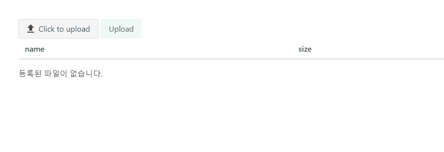

# U.STRA Framework - Buefy 기반 파일 업로드

> U.STRA Framework 의 NODE, JAVA 파일 업로드 구현을 Buefy 기반 컴포넌트를 사용하여 구축할 수 있다.
> 

# Objectives

- U.STRA Framework NODE, JAVA를 사용하여 API를 작성하고 이를 화면과 연계하는 방법을 익힌다.
- Buefy 기반의 컴포넌트를 활용하여 파일 업로드 연계를 API를 통해 송수신할 수 있다.
- Store를 사용하여 공용 데이터를 클라이언트에서 관리하고 캐싱할 수 있다.
- Vue 컴포넌트 간의 통신을 통해 데이터를 송수신하고 UI로 표시할 수 있다.

# What You Need

- 약 20분 소요
- 선호하는 텍스트 편집기 혹은 IDE
- Node 12.19 이상, Yarn 1.22.19 이상
- JDK 1.8 이상, Gradle 6.x 버전 혹은 Maven 3.2 이상

# How to complete this guide

- 처음부터 시작하기
    - 프로젝트 시작하기 : [http://guide.ustraframework.kro.kr/download/installation](http://guide.ustraframework.kro.kr/download/installation)
- 다운로드하여 실행하기
    - Repository에서 Clone : [https://github.com/ustraframework/ustra-framework2.0-sample](https://github.com/ustraframework/ustra-framework2.0-sample)

# 예제 파일 다운로드

아래와 같이 github에서 샘플 전체를 다운로드 할 수 있으며, 다운로드 후 buefy-file-upload 디렉토리로 이동한다.

```
git clone https://github.com/ustraframework/ustra-framework2.0-sample.git
```

- 코드 위치 : [https://github.com/ustraframework/ustra-framework2.0-sample/tree/master/buefy-file-upload](https://github.com/ustraframework/ustra-framework2.0-sample/tree/master/buefy-file-upload)

# Java

java 프로젝트는 management 라이브러리를 사용하지 않는 상태로 구축한다. management 모델을 사용할 경우 프레임워크에서 제공하는 공통 RDB 저장소를 통해 파일 업로드 및 다운로드 등의 기능을 제공하는 컨트롤러를 기본 제공하나 현 예제에서는 프레임워크 순수 기능을 사용하여 파일 연계를 전체 구현하는 것으로 진행한다.

전체 파일의 구성은 다음과 같다.

```
java
├── build.gradle
├── pom.xml
└── src/main/java
│   ├── io.ustra.framework2.sample
│   │   └── config
│   │       └── FileConfiguration.java
│   │       └── SecurityConfiguration.java
│   │       └── SwaggerConfiguration.java
│   │────── file
│   │       └── FileController.java
│   │       └── FileMapper.java
│   │       └── JdbcFileMetaDataStorage.java
│   ├────── BuefyApplication.java
└── src/main/resources
    ├── mapper/file
    │   └── FileMapper.xml
    ├── application.yml
    └── schema.sql
```

## build.gradle / pom.xml

management 라이브러리를 사용하지 않으므로 관련된 의존 라이브러리를 별도로 참조한다.

- build.gradle

```groovy
compile "com.gsitm.ustra.java:ustra-autoconfigure:${ustraVersion}"
compile "com.gsitm.ustra.java:ustra-data-mybatis:${ustraVersion}"
compile "com.gsitm.ustra.java:ustra-mvc-view:${ustraVersion}"
testCompile "com.gsitm.ustra.java:ustra-test:${ustraVersion}"

runtimeOnly 'com.h2database:h2'
```

- pom.xml

```xml
<dependency>
	<groupId>com.gsitm.ustra.java</groupId>
	<artifactId>ustra-autoconfigure</artifactId>
	<version>${ustra.version}</version>
</dependency>

<dependency>
	<groupId>com.gsitm.ustra.java</groupId>
	<artifactId>ustra-data-mybatis</artifactId>
	<version>${ustra.version}</version>
</dependency>

<dependency>
	<groupId>com.gsitm.ustra.java</groupId>
	<artifactId>ustra-mvc-view</artifactId>
	<version>${ustra.version}</version>
</dependency>

<dependency>
	<groupId>com.gsitm.ustra.java</groupId>
	<artifactId>ustra-mvc-test</artifactId>
	<version>${ustra.version}</version>
	<scope>test</scope>
</dependency>

<dependency>
	<groupId>com.h2database</groupId>
	<artifactId>h2</artifactId>
	<scope>runtime</scope>
</dependency>
```

## application.yml

```yaml
debug: true

server:
  port: 10001

spring:
  profiles:
    active: local
  h2:
    console:
      enabled: true
      settings:
        web-allow-others: true
  servlet:
    multipart:
      max-file-size: 100MB
      max-request-size: 100MB
      
mybatis:
  mapperLocations: classpath:/mapper/**/*.xml
  configuration:
    jdbc-type-for-null: "NULL"
   
 
ustra:
  data:
    datasource:
      default-datasource-name: rds1
      datasources:
        rds1:
          url: jdbc:h2:mem:userdb;DB_CLOSE_DELAY=-1
          driver-class-name: org.h2.Driver
          username: sa
          password: 
          sql-script-encoding: utf-8           
    file:
      enabled: true
      crypto:
        enabled: true
      policies:
        DEFAULT:
          file-grp-nm: 기본 파일업로드 그룹
          sv-path: /upload
          max-sz: 0
          exten-lmt: "image/*"
          dir-struct-type: root-directory
          file-nm-sv-meth-type: random-exten
          file-crypto-type: none
          use-yn: true
  mvc:
    view:
      api-prefix: api
      client-crypto-key: MTM0eHJhM2Z2aTM5ZTgzNQ==
      type: front-ssr
    rest:
      exclude-wrapping-url-patterns: /v2/api-docs,/swagger-resources/**,/swagger-ui.html,/webjars/**,/h2-console/**
    wrapper:
      exclude-request-url-patterns: /v2/api-docs,/h2-console/**,/api/file
      exclude-response-url-patterns: /v2/api-docs,/h2-console/**,/api/file
```

위의 코드에 설정 주요 항목은 다음과 같다.

- spring.h2 : H2 DB를 사용하기 위한 console 설정
- spring.servlet.multipart : 파일 업로드 용량 확장
- mybatis : 마이바티스 설정
- ustra.data.datasoruce : H2 DB를 default DB로 설정
- ustra.data.file : 파일 모듈 관련 설정 추가, polices 항목은 파일을 업로드하는 파일 그룹에 대한 설정을 추가하였다. 관련된 상세 가이드는 “[http://guide.ustraframework.kro.kr/ref-doc/02/6r1KCmC8u357dFoFl4go](http://guide.ustraframework.kro.kr/ref-doc/02/6r1KCmC8u357dFoFl4go)” 을 참고한다.
- [ustra.mvc.rest](http://ustra.mvc.rest) : exclude-wrapping-url-patterns 설정으로 h2-console에 접근할 수 있도록 API Wrapping을 중지한다.
- ustra.mvc.wrapper : h2-console과 파일 관련 API를 Wrapping을 제외하여 멀티 파일 업로드 시 파싱 오류를 피한다.

## schema.sql

서버 구동 시, H2 DB에 테이블이 자동 생성되도록 SQL 문을 추가한다.

```sql
DROP TABLE IF EXISTS FILES;

CREATE TABLE FILES COMMENT '파일' (
  FILE_ID VARCHAR(50) NOT NULL COMMENT '파일아이디',
  FILE_NO NUMERIC NOT NULL COMMENT '파일번호',
  FILE_GRP_ID VARCHAR(50) NOT NULL COMMENT '파일그룹아이디',
  FILE_NM VARCHAR(500) NOT NULL COMMENT '파일명',
  ORG_FILE_NM VARCHAR(500) NOT NULL COMMENT '원본파일명',
  FILE_FMT_CONT VARCHAR(500) COMMENT '파일형식',
  SV_PATH VARCHAR(500) COMMENT '저장경로',
  FILE_SZ NUMERIC NOT NULL COMMENT '파일사이즈',
  PRIMARY KEY (FILE_ID, FILE_NO)
);
```

## 설정

io.ustra.framework2.sample.config 패키지 내의 설정 항목은 다음과 같다.

### FileConfiguration.java

```java
@Configuration
public class FileConfiguration {

	@Bean
	FileMetaDataStorage jdbcFileMetaDataStorage() {
		return new JdbcFileMetaDataStorage();
	}

	@Bean
	AbstractFileOperationProcessor defaultFileOperationProcessor(FileGroupPolicyStore fileGroupPolicyStore) {

		return new AbstractFileOperationProcessor(fileGroupPolicyStore, new FileOperationConfigurer() {

			@Override
			public ResourceInfoExtractorResolver resourceInfoExtractorResolver() {
				return new WebResourceInfoExtractorResolver();
			}

			@Override
			public FileMetaDataStorage fileMetaDataStorage() {
				return jdbcFileMetaDataStorage();
			}

		}) {

			@Override
			public boolean supports(String fileGrpId) {
				return true;
			}
		};
	}
}
```

AbstractFileOperationProcessor 객체를 Bean으로 등록한다. 등록 시에 WebResourceInfoExtractorResolver를 resourceInfoExtractorResolver로 설정하여 MultipartResource 객체를 지원할 수 있도록 설정하였다.

또한 JdbcFileMetaDataStorage 구현체를 fileMetaDataStorage로 설정하여 H2 저장소에 파일 정보를 저장할 수 있도록 설정하였다. JdbcFileMetaDataStorage는 아래 내용을 참고한다.

### SecurityConfiguration.java

```java
@Configuration
public class SecurityConfiguration {
	@Bean
    UstraSecurityConfigure h2SecurityConfigure() {
    	return new UstraSecurityConfigure() {
    		@Override
    		public void postConfigure(WebSecurity web) throws Exception {
    			web.ignoring().antMatchers("/h2-console/**");
    		}

    		@Override
    		public void postConfigure(HttpSecurity http) throws Exception {
    			http.sessionManagement().sessionCreationPolicy(SessionCreationPolicy.IF_REQUIRED);
    		}
    	};
    }
}
```

h2 console 접근 URL을 권한 체크 영역에서 제거하고, 세션을 사용하도록 설정한다.

## 파일 기능 구현

파일 기능 구현은 파일 저장소에 파일 정보 CRUD를 수행하는 JdbcFileMetaDataStorage, FileMapper와 API를 정의하는 FileController로 구성한다.

### JdbcFileMetaDataStorage.java

위의 FileConfiguration에서 metaDataStorage를 설정하기 위해 파일의 CRUD 작업을 연계하는 FileMetaDataStorage 인터페이스의 구현을 수행한다.

```java
@Transactional
public class JdbcFileMetaDataStorage implements FileMetaDataStorage {

	@Autowired private FileMapper fileMapper;

	@Override
	public List<FileMetaData> getMetaDatas(String fileGrpId, String fileId, List<Integer> fileNos) {
		return fileMapper.select(fileId, fileNos);
	}

	@Override
	public void addMetaData(String fileGrpId, FileMetaData metaData) {
		fileMapper.insert(metaData);
	}

	@Override
	public void delMetaData(String fileGrpId, String fileId, Integer fileNo) {
		fileMapper.delete(fileId, fileNo);
	}

	@Override
	public void delAllMetaData(String fileGrpId, String fileId) {
		fileMapper.delete(fileId, null);
	}

	@Override
	public String getNewFileId(String fileGrpId, String additionalKey) {
		return UstraSystemUtils.processBase62UniqueId();
	}

}
```

### [FileMapper.java](http://FileMapper.java) / FileMapper.xml

FileMapper는 마이바티스 Mapper를 구현하여 H2 DB와 연계를 수행한다.

- FileMapper.java

```java
@Mapper
public interface FileMapper {
	List<FileMetaData> select(@Param("fileId") String fileId, @Param("fileNos") List<Integer> fileNos);
	int insert(FileMetaData meta);
	int delete(@Param("fileId") String fileId, @Param("fileNo") Integer fileNo);
}
```

- FileMapper.xml

```xml
<?xml version="1.0" encoding="UTF-8"?>
<!DOCTYPE mapper PUBLIC "-//mybatis.org//DTD Mapper 3.0//EN"
        "http://mybatis.org/dtd/mybatis-3-mapper.dtd">

<mapper namespace="io.ustra.framework2.sample.file.FileMapper">

	<select id="select" resultType="com.gsitm.ustra.java.data.file.model.FileMetaData">
		SELECT FILE_NM AS FILE_NAME
			  ,SV_PATH AS FILE_PATH
			  ,FILE_FMT_CONT AS FILE_EXT
			  ,FILE_SZ AS FILE_SIZE
			  ,ORG_FILE_NM AS ORG_NAME
			  ,FILE_FMT_CONT AS ORG_EXT
			  ,FILE_SZ AS ORG_SIZE
			  ,FILE_ID
			  ,FILE_NO
		  FROM FILES
		 WHERE FILE_ID = #{fileId}
		 <if test="fileNos != null and fileNos.size() != 0"  >
			AND FILE_NO  IN
			<foreach collection="fileNos" item="fileNo" open="(" close=")" separator=",">
				 #{fileNo}
			</foreach>
			</if>
	</select>

	<insert id="insert">
		INSERT INTO FILES (
			FILE_ID,
			FILE_NO,
			FILE_GRP_ID,
			FILE_NM,
			ORG_FILE_NM,
			FILE_FMT_CONT,
			SV_PATH,
			FILE_SZ
		) VALUES (
			#{fileId},
			#{fileNo},
			#{fileGrpId},
			#{fileName},
			#{orgName},
			#{fileExt},
			#{filePath},
			#{fileSize}
		)
	</insert>

	<delete id="delete">
		DELETE FILES
		 WHERE FILE_ID = #{fileId}
		 <if test="fileNo != null"  >
		   AND FILE_NO = #{fileNo}
		 </if>
	</delete>
</mapper>
```

### FileController.java

FileController는 클라이언트와 API 형태로 연계하여 다음과 같은 기능을 제공한다.

- 파일 그룹 정책 조회
- 파일 목록 조회
- 파일 업로드
- 파일 다운로드

파일 업로드 및 다운로드 작업을 수행하므로 컨트롤러는 @RestController가 아닌 @Controller로 구현한다.

```java
@Controller
@RequestMapping("/api/file")
public class FileController {
	
	// 파일 모듈의 조작을 위한 주입
	@Autowired private FileOperationManager fileOperationManager;

  // 파일 정책 조회를 위한 주입
	@Autowired private FileGroupPolicyStore fileGroupPolicyStore;
	
	...
}
```

- 파일 정책 조회
    
    파일 정책 조회는 FileGroupPolicyStore 객체를 List로 변경하여 리턴한다.
    
    ```java
    @GetMapping("/groups")
    @ResponseBody
    Collection<FileGroupPolicy> groups() {
    	return this.fileGroupPolicyStore.getAll().values();
    }
    ```
    

- 파일 목록 조회
    
    파일 목록은 파일 그룹 아이디와 파일 아이디를 수신하여 조회 조건에 맞는 파일 목록을 조회하도록 리턴한다.
    
    ```java
    @GetMapping("")
    	@ResponseBody
    	Collection<FileMetaData> files(@RequestParam String fileGrpId, @RequestParam String fileId) {
    		return fileOperationManager.getMetaDatas(
    				FileMetaDataInput.builder().
    					fileGrpId(fileGrpId).
    					fileId(fileId).
    					build()
    		);
    	}
    ```
    

- 파일 업로드
    
    파일 업로드는 파라메터로 MultipartHttpServletRequest를 수신한다. 파일 업로드는 단순 업로드가 아닌 수정 모드도 고려해야 하므로 다음과 같은 기준을 가지고 파싱하여 FileUploadInput 객체를 생성한다.
    
    1) “file-{순번}” 으로 시작하는 파라메터는 수정 모드 시에는 유지할 파일번호 또는 File 객체가 유입된다.
    
    2) 순번은 1번부터 시작하고, 다음 번호의 파라메터가 존재하지 않을 경우는 파싱을 제외한다.
    
    3) 파라메터의 유형을 확인하여 숫자일 경우는 FileNo 목록에 넣고, File일 경우는 Resource로 변환하여 Resource 객체에 설정한다.
    
    위와 같은 규칙이 적용된 코드는 다음과 같다.
    
    ```java
    @PostMapping("")
    @ResponseBody
    String upload(MultipartHttpServletRequest request) {
    
    	FileUploadInput.UploadFile uploadFiles = new FileUploadInput.UploadFile();
    	List<Resource> resources = new LinkedList<>();
    	List<Integer> fileNos = new LinkedList<>();
    
    	int i = 0;
    	while(true) {
    		i++;
    		if(request.getMultiFileMap().get("file-" + (i)) != null) {
    			List<MultipartFile> files = request.getMultiFileMap().get("file-" + (i));
    			for (MultipartFile file : files) {
    				resources.add(new UstraMultipartFileResource(file));
    			}
    		}
    
    		if(StringUtils.isNotEmpty(request.getParameter("file-" + (i)))) {
    			Integer number = Integer.parseInt(request.getParameter("file-" + (i)));
    			fileNos.add(number);
    		}
    
    		if(request.getMultiFileMap().get("file-" + (i + 1)) == null && StringUtils.isEmpty(request.getParameter("file-" + (i + 1)))) {
    			break;
    		}
    
    	}
    
    	uploadFiles.setResources(resources);
    	uploadFiles.setFileNos(fileNos);
    
    	FileUploadInput input = FileUploadInput.builder()
    			.fileGrpId(request.getParameter("fileGrpId"))
    			.fileId(request.getParameter("fileId"))
    				.files(FileUploadInput.UploadFile.ofResourceAndMetaData(fileNos, resources))
    			.build();
    
    	FileUploadOutput output = fileOperationManager.upload(input);
    
    	return output.getFileId();
    
    }
    ```
    

규칙에 맞게 FileUploadInput 파라메터를 만들었다면 fileOperationManager.upload 메소드를 호출하는 것으로 파일 업로드 및 수정 작업은 종료된다.

API에서는 return된 파일 아이디 값을 반환하여 클라이언트에서 후속 처리를 할 수 있도록 한다.

- 파일 다운로드
    
    WebResourceAttachFileConverter를 사용하여 파일을 다운로드할 수 있는 API를 구현한다.
    
    ```java
    @GetMapping("/attach")
    public ResponseEntity<?> attachConvert(
    		@RequestParam String fileId,
    		@RequestParam Integer fileNo,
    		@RequestParam String fileGrpId,
    		@RequestParam String attachmentFileName,
    		@RequestParam Integer attach,
    		HttpServletRequest request,
    		HttpServletResponse response) {
    
    	return fileOperationManager.convert(
    			WebResourceAttachFileConverter.builder(fileGrpId, attachmentFileName, attach > 0, request, response)
    			.metaDataId(FileConvertInput.FileMetaId.builder().fileId(fileId).fileNos(fileNo == null ? null :Arrays.asList(fileNo)).build())
    			.build());
    
    }
    ```
    

# 클라이언트 구현

node 디렉토리에서 Nuxt 클라이언트를 구현한다. 파일 구성은 다음과 같다.

```
node
├── package.json
├── nuxt.config.ts
├── tsconfig.json
├── client
│   ├── components
│   │   └── file-uploader.vue
│   ├── layouts
│   │   └── default.vue
│   ├── pages
│   │   └── index.vue
│   ├── services
│   │   └── file-service.ts
│   ├── store
│   │   └── file-module.ts
│   │   └── index.ts
├── config
│   ├── demo.local.yml
│   ├── demo.production.yml
├── types
└───└── index.d.ts
```

## 환경 설정

### package.json

해당 프로젝트는 nuxt buefy 모듈을 사용하므로 다음과 같이 의존성을 설정한다.

```json
{
	"dependencies": {
		"@ustra/core": "2.1.1-snapshot.8",
		"@ustra/nuxt": "2.1.1-snapshot.8",
		"@ustra/nuxt-buefy": "2.1.1-snapshot.8"
	},
}
```

SSR 어플리케이션이므로 아래와 같이 스크립트를 추가한다.

```json
"scripts": {
  "dev": "cross-env NODE_ENV=development CONFIG_ENV=local nuxt dev",
  "build": "cross-env NODE_ENV=production CONFIG_ENV=local nuxt build",
  "start": "cross-env NODE_ENV=production CONFIG_ENV=local nuxt build"
}
```

## tsconfig.json

nuxt-buefy와 프로젝트 내의 확장 Type을 제공하기 위해 compilerOptions.types 항목을 다음과 같이 설정한다.

```json
{
	"compilerOptions": {
		"types": ["@types/node", "@types/jest", "@nuxt/types", "@ustra/nuxt", "@ustra/nuxt-buefy", "./types"]
	}
}
```

## 어플리케이션 설정

어플리케이션의 설정은 config 디렉토리내의 yml파일과 nuxt.config.ts에서 수행한다.

### demo.local.yml

```yaml
server:
  host: 0.0.0.0
  port: 9001
  apiServerBaseUrl: http://localhost:9001
nuxt:
  module: { useProxy: { '/api/': { target: 'http://localhost:10001' } } }
```

Java API와 통신할 수 있도록 proxy 설정을 추가하였다.

### nuxt.config.ts

```tsx
import { configProperties } from '@ustra/core'
import NuxtConfigLoader from '@ustra/nuxt/src/config/nuxt-config-loader'
import NuxtAppProperties from '@ustra/nuxt/src/config/nuxt-app-properties'

export default async () => {
  const config: NuxtAppProperties = {
    app: {
      processPath: __dirname,
      profile: process.env.CONFIG_ENV,
      configDir: 'config',
      deviceType: configProperties.DeviceType.ALL,
      title: 'Demo Nuxt Buefy App',
      auth: {
        enabled: false,
      },
    },
    server: {
			// SSR 어플리케이션
      type: configProperties.ServerType.CONNECT,
    },
    nuxt: {
      module: {
				// buefy 사용 설정
        useUstraBuefy: {},
      },
      head: {
        titleTemplate: 'Demo Nuxt Buefy App',
        title: '',
      },
    },
  }
	
  return await NuxtConfigLoader.nuxtConfig(config, (_prop, _config) => {})
}
```

## 서비스 제작

services 디렉토리에 file-service.ts 파일을 생성한 후 각 API와 연계되는 모델과 서비스 메소드를 작성한다.

```tsx
import { ApiResponse } from '@ustra/data/src/models/api-model'
import { HttpMethod } from '@ustra/core/src/server/http/const'
import { UtraService } from '@ustra/nuxt/src/services/ustra-service'

export interface FileMetaData {
  /**
   * 파일 아아디
   */
  fileId: string

  /**
   * 파일 번호
   */
  fileNo: number

  /**
   * 파일 명
   */
  fileName: string

  /**
   * 파일 경로
   */
  filePath: string

  /**
   * 파일 확장자
   */
  fileExt: string

  /**
   * 파일 사이즈
   */
  fileSize: number

  /**
   * 원본 파일명
   */
  orgName: string
}

export interface FileGroupPolicy {
  /**
   * 파일 그룹 아이디
   */
  fileGrpId: string

  /**
   * 파일 그룹 명
   */
  fileGrpNm: string

  /**
   * 최대 사이즈
   */
  maxSz: number

  /**
   * 확장자 제한
   */
  extenLmt: string
}

export class FileService extends UtraService {
  /**
   * 파일 그룹 정책 목록 조회
   */
  async getFileGroupPolicies() {
    return (
      await this.$ustra.api.call<ApiResponse<FileGroupPolicy[]>>({
        url: '/api/file/groups',
        method: HttpMethod.GET,
      })
    )?.data?.body
  }

  /**
   * 파일 목록 조회
   * @param fileGrpId
   * @param fileId
   */
  async getFiles(fileGrpId: string, fileId: string) {
    return (
      await this.$ustra.api.call<ApiResponse<FileMetaData[]>>({
        url: '/api/file',
        method: HttpMethod.GET,
        params: {
          fileGrpId,
          fileId,
        },
      })
    )?.data?.body
  }

  /**
   * 파일 업로드
   * @param formData
   * @returns
   */
  async uploadFile(formData: FormData) {
    return (
      await this.$ustra.api
        .call<ApiResponse<string>>({
          url: '/api/file',
          method: HttpMethod.POST,
          headers: { contentType: false, processData: false, enctype: 'multipart/form-data' },
          data: formData,
          timeout: 6000000,
          passOnResponseError: false,
        })
        .catch(e => {
          alert('파일 업로드 중 오류가 발생하였습니다.')
          throw e
        })
    )?.data?.body
  }

  /**
   * 파일 다운로드
   * @param fileGrpId 파일 그룹 아이디
   * @param fileId 파일 아이디
   * @param fileNo 파일 No
   * @param attachmentFileName 다운로드받을 파일 명
   */
  async downloadFile(fileGrpId: string, fileId: string, fileNo: number, attachmentFileName: string) {
    this.$ustra.api
      .downloadFile({
        url: '/api/file/attach',
        fileName: attachmentFileName,
        method: HttpMethod.GET,
        params: {
          fileGrpId,
          fileId,
          fileNo,
          attachmentFileName,
          attach: 1,
        },
        showLoading: true,
      })
      .catch(e => {
        alert('파일 다운로드 중 오류가 발생하였습니다.')
      })
  }
}

export const fileService = new FileService()
```

파일 다운로드의 경우는 call 메소드가 아닌 downloadFile 메소드를 사용하는 것에 유의하자.

## 스토어 생성

파일 그룹에 대한 정책은 파일 업로드 컴포넌트 사용 시마다 호출하는 것이 아닌 초기 호출 후, 캐싱하여 사용할 수 있도록 스토어를 생성한다.

### ~/store/file-module.ts

```tsx
import { VuexModule, Module, Mutation, Action } from 'vuex-module-decorators'
import { CombinedContext } from '@ustra/nuxt/src/vue/store'
import { Storage } from '@ustra/nuxt/src/vue/store/decorators'
import { fileService, FileGroupPolicy } from '~/services/file-service'

@Module({
  name: 'file',
  namespaced: true,
  stateFactory: true,
})
export class FileModule extends VuexModule {
  fileGroupPolices: Record<string, FileGroupPolicy> = {}

  @Mutation
  @Storage({ type: 'session', propertyKey: 'fileGroupPolicies', defaultValue: [] })
  setFileGroupPolices(fileGroupPolices: FileGroupPolicy[]) {
    const fileGroupMap = {}
    fileGroupPolices.forEach(p => (fileGroupMap[p.fileGrpId] = p))

    this.fileGroupPolices = fileGroupMap
  }

  @Action
  async nuxtClientInit(ctx: CombinedContext) {
    this.setFileGroupPolices(await fileService.getFileGroupPolicies())
  }
}
```

클라이언트 로딩 시 파일 정책을 조회하여 저장하고, @Storage 데코레이터를 사용하여 브라우저 리로드 시에도 재조회하지 않도록 처리한다.

### ~/store/index.ts

생성한 모듈을 createStore 메소드를 사용하여 등록한다.

```tsx
import { createStore } from '@ustra/nuxt/src/vue/store'
import { FileModule } from './file-module'

export default () =>
  createStore({
    file: FileModule,
  })
```

### types/index.d.ts

생성한 Store 모듈의 type을 유추할 수 있도록 Type을 추가확장한다.

```tsx
import { FileModule } from '~/store/file-module'

declare module '@ustra/nuxt/src/vue/store/index' {
  interface StoreModules {
    file?: () => FileModule
  }
}
```

위와 같이 설정할 경우, `this.$ustra.store.file()` 메소드를 사용하면 FileModule 대상임을 알 수 있어 TypeSafe 한 코드를 생성할 수 있다.

## 컴포넌트 제작

이제 본격적으로 컴포넌트를 제작한다.

### ~/layouts/default.vue

기본 레이아웃은 프레임워크 제공하는 다이얼로그와 로딩을 제공하는 컴포넌트를 추가하여 제작한다. 해당 컴포넌트가 없으면 alert 등과 같은 대화 상자와 API 호출 시 로딩바가 보이지 않으므로 반드시 추가하거나 커스토마이징한 컴포넌트를 세팅해야 한다.

```html
<template>
  <div>
    <nuxt />
    <UBLoading />
    <UBDialog />
  </div>
</template>
<script lang="ts">
import { Component } from 'vue-property-decorator'
import { UstraComponent } from '@ustra/nuxt/src/vue/components/ustra-component'
import UBLoading from '@ustra/nuxt-buefy/src/components/u-b-loading.vue'
import UBDialog from '@ustra/nuxt-buefy/src/components/u-b-dialog.vue'

@Component({
  components: { UBLoading, UBDialog },
})
export default class extends UstraComponent {}
</script>
```

### ~/components/file-uploader.vue

이제 본격적으로 파일 업로드 컴포넌트를 제작할 차례이다.

- 템플릿
    
    1) buefy에서 제공하는 b-upload 컴포넌트를 사용하여 파일 선택 버튼을 만들고 파일이 선택될 경우 onFileSelected 메소드를 호출하도록 처리한다.
    
    2) 파일이 선택되면 b-table 컴포넌트를 사용하여 목록을 표시하며, 데이터 항목 중 no 값이 존재할 경우는 다운로드 버튼을 노출한다.
    
    3) Upload 버튼을 클릭하면 파일을 서버로 업로드 한다.
    
    ```html
    <template>
      <div style="margin: 50px">
        <b-upload v-model="tempSelectedFiles" :accept="policy ? policy.extenLmt : ''" @input="onFileSelected" multiple>
          <span class="file-cta">
            <b-icon class="file-icon" icon="upload"></b-icon>
            <span class="file-label">Click to upload</span>
          </span>
        </b-upload>
        <b-button type="is-success is-light" @click="upload">Upload</b-button>
        <b-table :data="files">
          <b-table-column field="name" label="name" v-slot="props">
            {{ props.row.name }}
          </b-table-column>
    
          <b-table-column field="size" label="size" v-slot="props" :width="100">
            {{ props.row.size | fileSizeFormat }}
          </b-table-column>
    
          <b-table-column field="size" label="" v-slot="props">
            <b-button @click="removeFile(props)" type="is-danger is-light">삭제</b-button>
            <b-button v-if="props.row.no" @click="downloadFile(props.row)" type="is-warning is-light">다운로드</b-button>
          </b-table-column>
        </b-table>
        <div v-if="files.length < 1">등록된 파일이 없습니다.</div>
      </div>
    </template>
    ```
    

- Prop 정의
    
    Prop은 파일 그룹 아이디와 파일 아이디를 수신받도록 세팅한다. 
    
    - fileGroupId : Store에서 파일 그룹 정보를 조회하여 파일의 사이즈 또는 확장자를 제한하는 용도로 사용. 필수 값이며 파일 그룹이 Store에서 조회되지 않을 경우 에러를 발생한다.
    - fileId : PropSync로 설정하여 양방향 바인딩을 수행한다. 해당 값이 있을 경우는 수정 모드로 동작한다.
    
    ```tsx
    /**
     * 파일 그룹 아이디
     */
    @Prop({ type: String, required: true }) readonly fileGroupId: string
    
    /**
     * 파일 아이디(수정 시 사용)
     */
    @PropSync('fileId') syncFileId: string
    ```
    
- 파일 그룹 조회
    
    craeted 훅에서 유입된 fileGroupId의 파일 그룹 정보를 조회한다.
    
    ```tsx
    created() {
    	// 스토어에서 세션 스토리지에 정보를 저장했으므로 서버 상에서는 실행하지 않는다.
      if (process.server) {
        return
      }
    
      this.policy = this.store.fileGroupPolices[this.fileGroupId]
    
      if (!this.policy) {
        throw new Error('파일 그룹 정책을 찾을 수 없습니다.')
      }
    }
    ```
    

- 파일 선택 시 처리
    
    파일 선택 시에는 onFileSelected 메소드에서 파일 사이즈를 확인하고 이상이 없을 경우, file 목록에 추가한다.
    
    ```tsx
    onFileSelected(selectedFiles: File[]) {
        this.tempSelectedFiles = []
    
        for (const selectedFile of selectedFiles) {
          if (this.policy.maxSz > 0 && this.policy.maxSz > selectedFile.size) {
            alert('파일 사이즈가 너무 큽니다.')
            return
          }
    
          this.files.push({
            name: selectedFile.name,
            size: selectedFile.size,
            fileObject: selectedFile,
          })
        }
      }
    ```
    

- 파일 제거
    
    파일 삭제 버튼을 클릭했을 때는 files 데이터중 선택된 index를 제거한다.
    
    ```tsx
    removeFile(p) {
      this.files.splice(p.index, 1)
    }
    ```
    

- 파일 업로드
    
    파일 업로드 시에는 API에서 정한 규칙대로 FormData를 생성하여 API를 호출한다.
    
    ```tsx
    async upload() {
      // craete FormData
      const formData = new FormData()
      formData.append('fileGrpId', this.fileGroupId)
    
      if (this.syncFileId) {
        formData.append('fileId', this.syncFileId)
      }
    
      let index = 0
      this.files.forEach(file => {
        formData.append(`file-${++index}`, file.fileObject ?? file.no)
      })
    
      const fileId = await fileService.uploadFile(formData)
      this.syncFileId = null
    
      await this.$nextTick()
    
      this.syncFileId = fileId
    }
    ```
    
    파일 업로드 후에 파일 아이디가 반환되면 fileId 값을 변경하여 수정 모드로 변경한다. syncFileId 값 변경 사이즈 nextTick 메소드를 호출하는 것은 prop의 값을 변경하는 것은 비동기로 동작하기 때문에 순서대로 값이 변경되도록 delay를 설정한다.
    
- 파일 다운로드
    
    파일 다운로드는 fileService 메소드를 호출하여 구현한다.
    
    ```tsx
    downloadFile(row) {
      fileService.downloadFile(this.fileGroupId, this.syncFileId, row.no, row.name)
    }
    ```
    

- 파일 목록 조회
    
    파일 목록을 조회하여 수정모드로 변환하는 과정은 fileId 값의 변경을 감지하여 fileId가 존재할 경우 파일 정보를 조회하여 처리토록 한다.
    
    ```tsx
    @Watch('fileId', { immediate: true })
    async onfileIdChanged(v) {
      this.files = []
      await this.$nextTick()
    
      if (v) {
        const files = await fileService.getFiles(this.fileGroupId, v)
        files.forEach(f => {
          this.files.push({
            name: f.orgName,
            size: f.fileSize,
            no: f.fileNo,
          })
        })
      }
    }
    ```
    

### ~/pages/index.vue

파일 업로드 컴포넌트가 구현되었으므로 시작화면에 컴포넌트를 배치한다.

```html
<template>
  <div>
    <FileUploader fileGroupId="DEFAULT" :fileId.sync="fileId" />
  </div>
</template>
<script lang="ts">
import { Component } from 'vue-property-decorator'
import { UstraComponent } from '@ustra/nuxt/src/vue/components/ustra-component'
import FileUploader from '~/components/file-uploader.vue'

@Component({
  components: { FileUploader },
})
export default class extends UstraComponent {
  fileId = null
}
</script>
```

# 구동

dev 명령어를 사용하여 어플리케이션을 구동하고, 동작을 확인한다.

```bash
yarn run dev
```

다음과 같이 파일 업로드가 동작하는 것을 볼 수 있다.



# SEE ALSO

- **API 만들기** : [http://guide.ustraframework.kro.kr/ref-doc/02/4l3Rzq1sZK6s5UQxwMIp](http://guide.ustraframework.kro.kr/ref-doc/02/4l3Rzq1sZK6s5UQxwMIp)
- **nuxt.config.ts 만들기 :** [http://guide.ustraframework.kro.kr/ref-doc/03/0YY3vWDM1zupzXCLSkXH](http://guide.ustraframework.kro.kr/ref-doc/03/0YY3vWDM1zupzXCLSkXH)
- **구조적 프로그래밍 하기 :** [http://guide.ustraframework.kro.kr/ref-doc/03/4Z0dAqyWRLIQ1B5EiVjP](http://guide.ustraframework.kro.kr/ref-doc/03/4Z0dAqyWRLIQ1B5EiVjP)
- **파일 기본 가이드** : [http://guide.ustraframework.kro.kr/ref-doc/02/6r1KCmC8u357dFoFl4go](http://guide.ustraframework.kro.kr/ref-doc/02/6r1KCmC8u357dFoFl4go)
- **파일 커스토마이징** : [http://guide.ustraframework.kro.kr/ref-doc/02/2QZboDrlBHm3J2gEI1WM](http://guide.ustraframework.kro.kr/ref-doc/02/2QZboDrlBHm3J2gEI1WM)
- **Buefy** : [http://guide.ustraframework.kro.kr/ref-doc/03/7fHnqh6sfgK821vGXlkS](http://guide.ustraframework.kro.kr/ref-doc/03/7fHnqh6sfgK821vGXlkS)