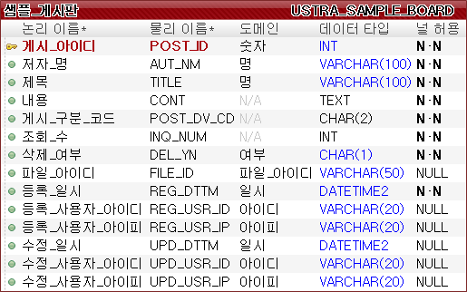
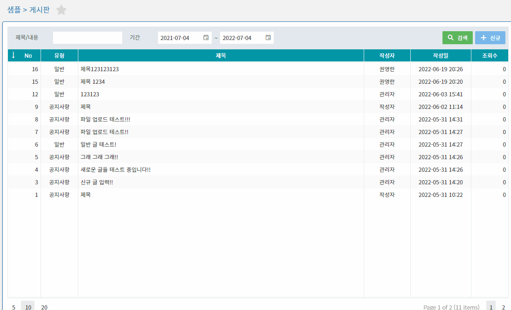

# U.STRA Framework - Devextreme 게시판

> U.STRA Framework 의 NODE, JAVA 기능을 사용하여 Devextreme UI 기반의 게시판 CRUD 프로그램을 제작할 수 있다.
> 

# Objectives

- U.STRA Framework NODE, JAVA를 사용하여 API를 작성하고 이를 화면과 연계하는 방법을 익힌다.
- Devextreme 기반의 API 와 Demo를 활용하여 제공 컴포넌트를 활용할 수 있다.
- Vue 컴포넌트 간의 통신을 통해 데이터를 송수신하고 UI로 표시할 수 있다.

# What You Need

- 약 20분 소요
- 선호하는 텍스트 편집기 혹은 IDE
- Node 1.22.0 이상, Yarn 1.22.4 이상
- JDK 1.8 이상, Gradle 6.x 버전 혹은 Maven 3.2 이상

# How to complete this guide

- 처음부터 시작하기
    - 프로젝트 시작하기 : [http://guide.ustraframework.kro.kr/download/installation](http://guide.ustraframework.kro.kr/download/installation)
- 다운로드하여 실행하기
    - Repository에서 Clone : [https://github.com/ustraframework/ustra-framework2.0-sample](https://github.com/ustraframework/ustra-framework2.0-sample)

# 예제 파일 다운로드

아래와 같이 github에서 샘플 전체를 다운로드 할 수 있으며, 다운로드 후 devextrme-board-crud 디렉토리로 이동한다.

```
git clone https://github.com/ustraframework/ustra-framework2.0-sample.git
```

- 코드 위치 : [https://github.com/ustraframework/ustra-framework2.0-sample/tree/master/devextreme-board-crud](https://github.com/ustraframework/ustra-framework2.0-sample/tree/master/devextreme-board-crud)

# 모델링

게시판을 작성하기 위한 모델을 아래와 같이 작성한다. 예시에 있는 모델은 MSSQL 기반이며, 각 테스트 용도의 DBMS에 맞게 상세 데이터 유형은 변경하도록 한다.



```sql
/* 샘플_게시판 */
CREATE TABLE [USTRA_SAMPLE_BOARD] (
	[POST_ID] [INT] NOT NULL IDENTITY (1,  1),  /* 게시_아이디 */
	[AUT_NM] [VARCHAR](100) NOT NULL,  /* 저자_명 */
	[TITLE] [VARCHAR](100) NOT NULL,  /* 제목 */
	[CONT] [TEXT] NOT NULL,  /* 내용 */
	[POST_DV_CD] [CHAR](2) NOT NULL,  /* 게시_구분_코드 */
	[INQ_NUM] [INT] NOT NULL DEFAULT 0,  /* 조회_수 */
	[DEL_YN] [CHAR](1) NOT NULL DEFAULT 'N',  /* 삭제_여부 */
	[FILE_ID] [VARCHAR](50),  /* 파일_아이디 */
	[REG_DTTM] [DATETIME2] NOT NULL,  /* 등록_일시 */
	[REG_USR_ID] [VARCHAR](20),  /* 등록_사용자_아이디 */
	[REG_USR_IP] [VARCHAR](20),  /* 등록_사용자_아이피 */
	[UPD_DTTM] [DATETIME2],  /* 수정_일시 */
	[UPD_USR_ID] [VARCHAR](20),  /* 수정_사용자_아이디 */
	[UPD_USR_IP] [VARCHAR](20) /* 수정_사용자_아이피 */
)
GO

/* 샘플_게시판 기본키 */
ALTER TABLE [USTRA_SAMPLE_BOARD]
	ADD
		CONSTRAINT [PK_USTRA_SAMPLE_BOARD]
		PRIMARY KEY NONCLUSTERED (
			[POST_ID] ASC
		)
GO

/* 샘플_게시판 */
EXEC sp_addextendedproperty 
	@name=N'MS_Description', @value=N'샘플_게시판', 
	@level0type=N'SCHEMA', @level0name=N'dbo', 
	@level1type=N'TABLE', @level1name=N'USTRA_SAMPLE_BOARD'
GO

/* 게시_아이디 */
EXEC sp_addextendedproperty 
	@name=N'MS_Description', @value=N'게시_아이디', 
	@level0type=N'SCHEMA', @level0name=N'dbo', 
	@level1type=N'TABLE', @level1name=N'USTRA_SAMPLE_BOARD', 
	@level2type=N'COLUMN', @level2name=N'POST_ID'
GO

/* 저자_명 */
EXEC sp_addextendedproperty 
	@name=N'MS_Description', @value=N'저자_명', 
	@level0type=N'SCHEMA', @level0name=N'dbo', 
	@level1type=N'TABLE', @level1name=N'USTRA_SAMPLE_BOARD', 
	@level2type=N'COLUMN', @level2name=N'AUT_NM'
GO

/* 제목 */
EXEC sp_addextendedproperty 
	@name=N'MS_Description', @value=N'제목', 
	@level0type=N'SCHEMA', @level0name=N'dbo', 
	@level1type=N'TABLE', @level1name=N'USTRA_SAMPLE_BOARD', 
	@level2type=N'COLUMN', @level2name=N'TITLE'
GO

/* 내용 */
EXEC sp_addextendedproperty 
	@name=N'MS_Description', @value=N'내용', 
	@level0type=N'SCHEMA', @level0name=N'dbo', 
	@level1type=N'TABLE', @level1name=N'USTRA_SAMPLE_BOARD', 
	@level2type=N'COLUMN', @level2name=N'CONT'
GO

/* 게시_구분_코드 */
EXEC sp_addextendedproperty 
	@name=N'MS_Description', @value=N'게시_구분_코드', 
	@level0type=N'SCHEMA', @level0name=N'dbo', 
	@level1type=N'TABLE', @level1name=N'USTRA_SAMPLE_BOARD', 
	@level2type=N'COLUMN', @level2name=N'POST_DV_CD'
GO

/* 조회_수 */
EXEC sp_addextendedproperty 
	@name=N'MS_Description', @value=N'조회_수', 
	@level0type=N'SCHEMA', @level0name=N'dbo', 
	@level1type=N'TABLE', @level1name=N'USTRA_SAMPLE_BOARD', 
	@level2type=N'COLUMN', @level2name=N'INQ_NUM'
GO

/* 삭제_여부 */
EXEC sp_addextendedproperty 
	@name=N'MS_Description', @value=N'삭제_여부', 
	@level0type=N'SCHEMA', @level0name=N'dbo', 
	@level1type=N'TABLE', @level1name=N'USTRA_SAMPLE_BOARD', 
	@level2type=N'COLUMN', @level2name=N'DEL_YN'
GO

/* 파일_아이디 */
EXEC sp_addextendedproperty 
	@name=N'MS_Description', @value=N'파일_아이디', 
	@level0type=N'SCHEMA', @level0name=N'dbo', 
	@level1type=N'TABLE', @level1name=N'USTRA_SAMPLE_BOARD', 
	@level2type=N'COLUMN', @level2name=N'FILE_ID'
GO

/* 등록_일시 */
EXEC sp_addextendedproperty 
	@name=N'MS_Description', @value=N'등록_일시', 
	@level0type=N'SCHEMA', @level0name=N'dbo', 
	@level1type=N'TABLE', @level1name=N'USTRA_SAMPLE_BOARD', 
	@level2type=N'COLUMN', @level2name=N'REG_DTTM'
GO

/* 등록_사용자_아이디 */
EXEC sp_addextendedproperty 
	@name=N'MS_Description', @value=N'등록_사용자_아이디', 
	@level0type=N'SCHEMA', @level0name=N'dbo', 
	@level1type=N'TABLE', @level1name=N'USTRA_SAMPLE_BOARD', 
	@level2type=N'COLUMN', @level2name=N'REG_USR_ID'
GO

/* 등록_사용자_아이피 */
EXEC sp_addextendedproperty 
	@name=N'MS_Description', @value=N'등록_사용자_아이피', 
	@level0type=N'SCHEMA', @level0name=N'dbo', 
	@level1type=N'TABLE', @level1name=N'USTRA_SAMPLE_BOARD', 
	@level2type=N'COLUMN', @level2name=N'REG_USR_IP'
GO

/* 수정_일시 */
EXEC sp_addextendedproperty 
	@name=N'MS_Description', @value=N'수정_일시', 
	@level0type=N'SCHEMA', @level0name=N'dbo', 
	@level1type=N'TABLE', @level1name=N'USTRA_SAMPLE_BOARD', 
	@level2type=N'COLUMN', @level2name=N'UPD_DTTM'
GO

/* 수정_사용자_아이디 */
EXEC sp_addextendedproperty 
	@name=N'MS_Description', @value=N'수정_사용자_아이디', 
	@level0type=N'SCHEMA', @level0name=N'dbo', 
	@level1type=N'TABLE', @level1name=N'USTRA_SAMPLE_BOARD', 
	@level2type=N'COLUMN', @level2name=N'UPD_USR_ID'
GO

/* 수정_사용자_아이피 */
EXEC sp_addextendedproperty 
	@name=N'MS_Description', @value=N'수정_사용자_아이피', 
	@level0type=N'SCHEMA', @level0name=N'dbo', 
	@level1type=N'TABLE', @level1name=N'USTRA_SAMPLE_BOARD', 
	@level2type=N'COLUMN', @level2name=N'UPD_USR_IP'
GO

/* 샘플_게시판 기본키 */
EXEC sp_addextendedproperty 
	@name=N'MS_Description', @value=N'샘플_게시판 기본키', 
	@level0type=N'SCHEMA', @level0name=N'dbo', 
	@level1type=N'TABLE', @level1name=N'USTRA_SAMPLE_BOARD', 
	@level2type=N'CONSTRAINT', @level2name=N'PK_USTRA_SAMPLE_BOARD'
GO

/* 샘플_게시판 기본키 */
EXEC sp_addextendedproperty 
	@name=N'MS_Description', @value=N'샘플_게시판 기본키', 
	@level0type=N'SCHEMA', @level0name=N'dbo', 
	@level1type=N'TABLE', @level1name=N'USTRA_SAMPLE_BOARD', 
	@level2type=N'INDEX', @level2name=N'PK_USTRA_SAMPLE_BOARD'
GO
```

# JAVA API 생성

위와 같이 생성된 테이블의 CRUD 작업을 수행할 수 있도록 API를 작성한다.

## Model 생성

아래와 BoardDto 클래스와 검색 조건인 Creteria 내부 클래스를 생성한다.

```java
package io.ustra.framework2.sample.board;

import java.time.LocalDateTime;

import javax.validation.constraints.NotEmpty;
import javax.validation.constraints.NotNull;
import javax.validation.constraints.Positive;

import com.gsitm.ustra.java.data.validation.CrudGroups;
import com.gsitm.ustra.java.management.models.base.UstraManagementBaseModel;

import lombok.AllArgsConstructor;
import lombok.Builder;
import lombok.Data;
import lombok.EqualsAndHashCode;
import lombok.NoArgsConstructor;
import lombok.experimental.SuperBuilder;

@Data
@EqualsAndHashCode(callSuper = false)
@SuperBuilder
@NoArgsConstructor
@AllArgsConstructor
public class BoardDto extends UstraManagementBaseModel {

	/**
	 * 게시 아이디
	 */
	@Positive(message = "게시 아이디는 필수 입력입니다.", groups=CrudGroups.Edit.class)
	@NotNull(message = "게시 아이디는 필수 입력입니다.", groups=CrudGroups.Edit.class)
	private Integer postId;

	/**
	 * 저자 명
	 */
	@NotEmpty(message = "작성자 명은 필수 입력입니다.", groups= { CrudGroups.Add.class, CrudGroups.Edit.class })
	private String autNm;

	/**
	 * 제목
	 */
	@NotEmpty(message = "제목은 필수 입력입니다.", groups= { CrudGroups.Add.class, CrudGroups.Edit.class })
	private String title;

	/**
	 * 내용
	 */
	@NotEmpty(message = "내용은 필수 입력입니다.", groups= { CrudGroups.Add.class, CrudGroups.Edit.class })
	private String cont;

	/**
	 * 게시 구분 코드
	 */
	@NotNull(message = "게시 구분 코드는 필수 입력입니다.", groups= { CrudGroups.Add.class, CrudGroups.Edit.class })
	private PostDivision postDvCd;

	/**
	 * 조회 수
	 */
	private Integer inqNum;

	/**
	 * 삭제 여부
	 */
	private String delYn;

	/**
	 * 파일 아이디
	 */
	private String fileId;

	/**
	 * 검색 조건
	 * @author RoyLee
	 *
	 */
	@Data
	@Builder
	@NoArgsConstructor
	@AllArgsConstructor
	public static class Criteria {
		/**
		 * 검색 키워드
		 */
		private String keyword;

		/**
		 * 검색 시작일
		 */
		private LocalDateTime srtDate;

		/**
		 * 검색 종료일
		 */
		private LocalDateTime endDate;
	}
}
```

CrudGroups.Add 클래스와 CrudGroups.Edit 클래스를 사용하여 데이터 추가와 수정 시의 Validation 처리 설정을 추가한다.

검색 조건은 제목/내용을 검색할 수 있는 keyword와 작성 기간을 검색할 수 있는 검색 시작일, 종료일을 설정하였다.

게시 구분 코드의 경우, PostDivision enum으로 정의되어 있으며, CodeValueType 인터페이스와 연계되어 Mapper와 API에서 serializing, deserializing 될 수 있도록 enum을 작성하였다.

```java
package io.ustra.framework2.sample.board;

import com.gsitm.ustra.java.core.utils.data.CodeValueType;

/**
 * 게시 구분 코드
 * @author RoyLee
 *
 */
public enum PostDivision implements CodeValueType {
	/**
	 * 공지사항
	 */
	NOTICE("01"),

	/**
	 * 일반게시
	 */
	NORMAL("02");

	@Override
	public String getCode() {
		return this.code;
	}

	private String code;

	private PostDivision(String code) {
		this.code = code;
	}
}
```

## Mapper 작성

mapper는 /src/main/resources/mapper/board/BoardMapper.xml 경로에 생성한다.

```xml
<?xml version="1.0" encoding="UTF-8"?>
<!DOCTYPE mapper PUBLIC "-//mybatis.org//DTD Mapper 3.0//EN"
        "http://mybatis.org/dtd/mybatis-3-mapper.dtd">

<mapper namespace="io.ustra.framework2.sample.board.BoardMapper">

	<select id="select" resultType="io.ustra.framework2.sample.board.BoardDto">
		SELECT POST_ID,
			   TITLE,
			   AUT_NM,
			   POST_DV_CD,
			   INQ_NUM,
			   REG_DTTM
		  FROM USTRA_SAMPLE_BOARD
		 WHERE DEL_YN = 'N'
		 <if test="arg1.keyword != null and arg1.keyword != ''">
		   AND (
		   		TITLE LIKE '%' + #{arg1.keyword} + '%'
		   		OR
		   		CONTENT LIKE '%' + #{arg1.keyword} + '%'
		   )
		 </if>
		 <if test="arg1.srtDate != null">
		   AND REG_DTTM &gt; #{arg1.srtDate}
		 </if>
		 <if test="arg1.endDate != null">
		   AND REG_DTTM &lt; #{arg1.endDate}
		 </if>
	</select>

	<select id="selectDetail" resultType="io.ustra.framework2.sample.board.BoardDto">
		SELECT POST_ID,
			   TITLE,
			   CONT,
			   AUT_NM,
			   POST_DV_CD,
			   INQ_NUM,
			   FILE_ID,
			   REG_DTTM
		  FROM USTRA_SAMPLE_BOARD
		 WHERE POST_ID = #{postId}
	</select>

	<insert id="insert">
		<selectKey resultType="int" keyProperty="postId" order="AFTER">
			SELECT SCOPE_IDENTITY()
		</selectKey>
		INSERT INTO USTRA_SAMPLE_BOARD (
			AUT_NM,
			TITLE,
			CONT,
			POST_DV_CD,
			FILE_ID,
			REG_DTTM,
			REG_USR_ID,
			REG_USR_IP,
			UPD_DTTM,
			UPD_USR_ID,
			UPD_USR_IP
		) VALUES (
			#{autNm},
			#{title},
			#{cont},
			#{postDvCd},
			#{fileId},
			CURRENT_TIMESTAMP,
			#{regUsrId},
			#{regUsrIp},
			CURRENT_TIMESTAMP,
			#{updUsrId},
			#{updUsrIp}
		)
	</insert>

	<update id="update">
		UPDATE USTRA_SAMPLE_BOARD SET
			   AUT_NM = #{autNm},
			   TITLE = #{title},
			   CONT = #{cont},
			   POST_DV_CD = #{postDvCd},
			   UPD_DTTM = CURRENT_TIMESTAMP,
			   UPD_USR_ID = #{updUsrId},
			   UPD_USR_IP = #{updUsrIp}
		 WHERE POST_ID = #{postId}
	</update>

	<update id="delete">
		UPDATE USTRA_SAMPLE_BOARD SET
			  DEL_YN = 'Y'
		 WHERE POST_ID = #{postId}
	</update>
</mapper>
```

CRUD 쿼리를 매퍼에 작성하고 동일한 스키마로 인터페이스를 작성한다.

```java
@Mapper
public interface BoardMapper {

	List<BoardDto> select(PaginationRequest paginationRequest, BoardDto.Criteria criteria);
	BoardDto selectDetail(Integer postId);
	int insert(BoardDto board);
	int update(BoardDto board);
	int delete(Integer postId);
}
```

## Service 작성

서비스 또한 컨트롤러와 연계될 수 있도록 작성한다.

```java
package io.ustra.framework2.sample.board;

import java.util.List;

import javax.validation.Valid;
import javax.validation.groups.ConvertGroup;

import org.springframework.beans.factory.annotation.Autowired;
import org.springframework.stereotype.Service;
import org.springframework.transaction.annotation.Transactional;
import org.springframework.util.Assert;
import org.springframework.validation.annotation.Validated;

import com.gsitm.ustra.java.data.domains.PaginationRequest;
import com.gsitm.ustra.java.data.exception.UstraDataResponseCode;
import com.gsitm.ustra.java.data.validation.CrudGroups;

@Service
@Transactional
@Validated
public class BoardService {

	@Autowired private BoardMapper sampleBoardMapper;

	/**
	 * 게시 목록 조회
	 * @param paginationRequest 페이징 정보
	 * @param criteria 검색 조건
	 * @return 게시 목록
	 */
	public List<BoardDto> getBoards(PaginationRequest paginationRequest, BoardDto.Criteria criteria) {
		return sampleBoardMapper.select(paginationRequest, criteria);
	}

	/**
	 * 게시 아이디 조회
	 * @param postId 게시 아이디
	 * @return 게시 상세 정보
	 */
	public BoardDto get(Integer postId) {
		return sampleBoardMapper.selectDetail(postId);
	}

	/**
	 * 추가
	 * @param board 게시 정보
	 * @return 등록 정보
	 */
	public BoardDto add(@ConvertGroup(to=CrudGroups.Add.class) @Valid BoardDto board) {
		int result = sampleBoardMapper.insert(board);

		if (result < 1) {
			throw UstraDataResponseCode.CANNOT_SAVE_RECORD.exception();
		}

		return board;
	}

	/**
	 * 수정
	 * @param board 게시 정보
	 * @return 수정 정보
	 */
	public BoardDto edit(@ConvertGroup(to=CrudGroups.Edit.class) @Valid BoardDto board) {
		int result = sampleBoardMapper.update(board);

		if (result < 1) {
			throw UstraDataResponseCode.CANNOT_SAVE_RECORD.exception();
		}

		return board;
	}

	/**
	 * 삭제
	 * @param postId 게시 아이디
	 * @return 삭제 건수
	 */
	public int remove(Integer postId) {

		Assert.notNull(postId, "게시 아이디는 필수 값입니다.");

		return sampleBoardMapper.delete(postId);
	}

}
```

Validation 처리를 서비스에서 수행하므로 @Validated 어노테이션이 클래스에 위치하며 각 파라메터에 @Valid 어노테이션을 추가하였다.

## Controller 작성

REST 형태의 API를 제공하기 위해 각 메소드마다 CRUD를 수행할 수 있는 컨트롤러를 아래와 같이 작성한다.

```java
package io.ustra.framework2.sample.board;

import java.time.LocalDateTime;
import java.util.List;

import org.springframework.beans.factory.annotation.Autowired;
import org.springframework.format.annotation.DateTimeFormat;
import org.springframework.web.bind.annotation.DeleteMapping;
import org.springframework.web.bind.annotation.GetMapping;
import org.springframework.web.bind.annotation.PathVariable;
import org.springframework.web.bind.annotation.PostMapping;
import org.springframework.web.bind.annotation.PutMapping;
import org.springframework.web.bind.annotation.RequestBody;
import org.springframework.web.bind.annotation.RequestMapping;
import org.springframework.web.bind.annotation.RequestParam;
import org.springframework.web.bind.annotation.RestController;

import com.gsitm.ustra.java.mvc.rest.utils.UstraRestUtils;
import com.gsitm.ustra.java.security.authority.permission.Permission;

import io.ustra.framework2.sample.common.ProgramIds;

@RestController
@RequestMapping("/api/sample/board")
public class BoardController {

	@Autowired private BoardService boardService;

	@GetMapping("")
	@Permission
	List<BoardDto> getBoards(
			@RequestParam(required = false) String keyword,
			@RequestParam(required = false) @DateTimeFormat(iso = DateTimeFormat.ISO.DATE_TIME) LocalDateTime srtDate,
			@RequestParam(required = false) @DateTimeFormat(iso = DateTimeFormat.ISO.DATE_TIME) LocalDateTime endDate) {
		return boardService.getBoards(UstraRestUtils.getCurrentApiHeader(),
				BoardDto.Criteria
					.builder()
					.keyword(keyword)
					.srtDate(srtDate)
					.endDate(endDate)
					.build()
				);
	}

	@GetMapping("/{postId}")
	@Permission
	BoardDto getBoard(@PathVariable Integer postId) {
		return boardService.get(postId);
	}

	@PostMapping("")
	@Permission(roles = { ProgramIds.SAMPLE_BOARD })
	BoardDto add(@RequestBody BoardDto board) {
		return boardService.add(board);
	}

	@PutMapping("")
	@Permission(roles = { ProgramIds.SAMPLE_BOARD })
	BoardDto edit(@RequestBody BoardDto board) {
		return boardService.edit(board);
	}

	@DeleteMapping("/{postId}")
	@Permission(roles = { ProgramIds.SAMPLE_BOARD })
	void remove(@PathVariable Integer postId) {
		boardService.remove(postId);
	}
}
```

# 화면 제작

화면 제작은 node 프로젝트에서 수행할 수 있다.

## 환경 설정

해당 프로젝트는 백 오피스 관리 기능을 사용할 예정이므로 package.json의 dependencies를 아래와 같이 설정한다.

```bash
{
	"dependencies": {
    "@ustra/core": "2.0.45-snapshot.6",
    "@ustra/data": "2.0.45-snapshot.6",
    "@ustra/nuxt": "2.0.45-snapshot.6",
    "@ustra/nuxt-vuetify": "2.0.45-snapshot.6",
    "@ustra/nuxt-dx": "2.0.45-snapshot.6",
    "@ustra/nuxt-dx-mng-bo": "2.0.45-snapshot.6",
    "@ustra/nuxt-mng": "2.0.45-snapshot.6",
    "@ustra/nuxt-mng-bo": "2.0.45-snapshot.6"
  },
}
```

SPA 어플리케이션이므로 아래와 같이 스크립트를 추가한다.

```bash
{
	"scripts": {
    "dev": "cross-env NODE_ENV=development CONFIG_ENV=local nuxt",
    "generate": "cross-env NODE_ENV=production CONFIG_ENV=dev nuxt generate",
    "test": "jest --detectOpenHandles --forceExit",
    "create-off-pack": "rm -rf node_modules && rm yarn.lock && rm -rf npm_packages/* && yarn cache clean && yarn install"
  },
}
```

## 로컬 구동

dev 스크립트를 실행하여 로컬에서 프로그램을 실행한다.

```bash
yarn run dev
```

구동이 완료되면 [http://localhost:10002/](http://localhost:10002/) 로 접속한다. 관리자 계정으로 로그인 (admin / admin) 하여 메인 화면으로 접속한다.

## 시스템 설정

시스템 > 메뉴 관리 화면으로 이동하여 신규로 작성할 게시판 메뉴를 아래와 같이 등록한다. (이미 등록되어 있을 경우는 Skip)


메뉴 등록 후에는 “시스템 > 권한 관리” 메뉴로 이동하여, 시스템 관리자에 방금 등록한 메뉴의 권한을 추가한다.


설정 > 어플리케이션 메뉴로 이동하여 캐시 제거 버튼을 클릭하여 재 로그인한다.


아래와 같이 등록한 메뉴가 목록에 노출되는 것을 확인할 수 있다.


### 코드 입력

게시 글 분류인 POST_DV_CD는 공통 코드로 관리되는 데이터이므로 코드 관리에서 신규 입력이 필요하다.


위의 화면과 같이 그룹 코드를 등록한 후, 상세 코드를 2개 등록한다.


### 파일 그룹 등록

게시판에 파일을 등록하기 위해 “시스템 > 파일 그룹 관리” 화면으로 이동하여 파일 그룹을 아래와 같이 등록한다.


## 서비스 제작

services 디렉토리에 board-service.ts 파일을 생성한 후 각 API와 연계되는 서비스 메소드를 작성한다.

```tsx
import { BaseModel } from '@ustra/data/src/models/base-models'
import { ApiResponse } from '@ustra/data/src/models/api-model'
import { PaginationRequest } from '@ustra/data/src/models/pagination-model'
import { UstraService } from '@ustra/nuxt/src/services/ustra-service'
import { HttpMethod } from '@ustra/core/src/server/http/const'

/**
 * 검색 조건
 */
export interface Criteria {
  /**
   * 키워드
   */
  keyword?: string

  /**
   * 검색 시작일
   */
  srtDt?: Date

  /**
   * 검색 종료일
   */
  endDt?: Date
}

/**
 * 게시판
 */
export interface Board extends BaseModel {
  /**
   * 게시 아이디
   */
  postId?: number

  /**
   * 저자 명
   */
  autNm?: string

  /**
   * 제목
   */
  title?: string

  /**
   * 내용
   */
  cont?: string

  /**
   * 게시 구분 코드
   */
  postDvCd?: string

  /**
   * 조회 수
   */
  inqNum?: number

  /**
   * 파일 아이디
   */
  fileId?: string
}

export class SampleCrudService extends UstraService {
  /**
   * 게시 목록 조회
   * @param keyword 조회 키워드
   * @param srtDate 조회 시작일
   * @param endDate 조회 종료일
   * @returns 게시 목록
   */
  async getBoards(pagination: PaginationRequest, keyword?: string, srtDate?: Date, endDate?: Date) {
    return (
      await this.$ustra.api.call<ApiResponse<Board[]>>({
        url: '/api/sample/board',
        method: HttpMethod.GET,
        headers: {
          'rest-api-header': JSON.stringify(pagination),
        },
        params: {
          keyword,
          srtDate,
          endDate,
        },
      })
    )?.data
  }

  /**
   * 게시 상세 조회
   * @param postId 게시 아이디
   * @returns 상세 정보
   */
  async get(postId: number) {
    return (
      await this.$ustra.api.call<ApiResponse<Board>>({
        url: `/api/sample/board/${postId}`,
        method: HttpMethod.GET,
      })
    )?.data?.body
  }

  /**
   * 게시물 추가
   * @param data 입력 데이터
   */
  async add(data: Board) {
    return (
      await this.$ustra.api.call<ApiResponse<Board>>({
        url: '/api/sample/board',
        method: HttpMethod.POST,
        data,
      })
    )?.data?.body
  }

  /**
   * 게시물 수정
   * @param data 수정 데이터
   */
  async edit(data: Board) {
    return (
      await this.$ustra.api.call<ApiResponse<Board>>({
        url: '/api/sample/board',
        method: HttpMethod.PUT,
        data,
      })
    )?.data?.body
  }

  /**
   * 게시물 삭제
   * @param postId 게시 아이디
   */
  async remove(postId: number) {
    await this.$ustra.api.call<ApiResponse<Board>>({
      url: `/api/sample/board/${postId}`,
      method: HttpMethod.DELETE,
    })
  }
}

export const boardService = new SampleCrudService()
export default boardService
```

## 컴포넌트 제작

검색 영역과 목록 영역으로 분리하여 작성하며 검색은 상단의 검색 조건 입력 및 버튼이 위치하고 목록 영역은 그리드가 위치한다.

- 검색 영역 : ~/components/board/search.vue

```html
<template>
  <div>
    <u-button-bar>
      <u-field label="제목/내용" :label-width="80" :width="150" :full-width="true">
        <dx-text-box v-model="criteria.keyword" />
      </u-field>

      <u-field label="기간" :label-width="60" :width="250" :full-width="true">
        <dx-date-period-box v-model="searchDttm" width="100%" mode="date" />
      </u-field>

      <dx-button text="검색" icon="search" type="success" class="right" @click="e => $emit('click-search-button', this.criteria)" />
      <dx-button text="신규" icon="plus" type="default" @click="e => $emit('click-new-button')" />
    </u-button-bar>
  </div>
</template>
<script lang="ts">
import { Component } from 'vue-property-decorator'
import { UstraBoComponent } from '@ustra/nuxt-mng-bo/src/components/ustra-bo-component'
import { Criteria } from '~/services/board-sevice'

@Component
export default class extends UstraBoComponent {
  criteria: Criteria = {
    srtDt: this.$ustra.utils.date.addYears(new Date(), -1),
    endDt: new Date(),
    keyword: null,
  }

  get searchDttm() {
    return [this.criteria.srtDt, this.criteria.endDt]
  }

  set searchDttm(dates) {
    this.criteria.srtDt = dates[0]
    this.criteria.endDt = dates[1]
  }
}
</script>
```

검색은 API에서 제공하는 키워드와 검색 기간을 입력할 수 있는 Box와 검색 및 신규 버튼을 추가한다.

검색 기간은 기본 설정 값으로 현재 일시의 1년 간의 설정을 하도록 처리되어 있으며, 아래와 같은 이벤트를 발생하도록 한다.

- click-search-button : 검색 버튼 클릭 시
- click-new-button : 신규 버튼 클릭 시

목록 컴포넌트는 그리드와 더블클릭 시, 노출할 상세 화면 팝업이 위치하도록 처리한다.

- 목록 : ~/components/board/list.vue

```html
<template>
  <div style="width: 100%; height: 100%">
    <dx-data-grid
      ref="grid"
      width="100%"
      height="100%"
      :data-source="gridDataSource"
      :column-auto-width="false"
      :paging="{ pageSize: 10 }"
      :pager="{
        visible: true,
        displayMode: 'full',
        showPageSizeSelector: true,
        showInfo: true,
      }"
      @rowDblClick="
        e => {
          selectedBoard = e.data
          visiblePopup = true
        }
      "
    >
      <dx-column data-field="postId" data-type="number" caption="No" :width="70" sort-order="desc"></dx-column>
      <dx-column data-field="postDvCd" caption="유형" alignment="center" :width="80" :calculate-cell-value="data => getCmnCodeVal('POST_DV_CD', data.postDvCd)"></dx-column>
      <dx-column data-field="title" caption="제목" width="100%"></dx-column>
      <dx-column data-field="autNm" caption="작성자" alignment="center" :width="100"></dx-column>
      <dx-column data-field="regDttm" caption="작성일" alignment="center" :width="130" :calculate-cell-value="data => formatters.datetime(data.regDttm)"></dx-column>
      <dx-column data-field="inqNum" data-type="number" caption="조회수" :width="80"></dx-column>
    </dx-data-grid>
    <form-popup
      :visible.sync="visiblePopup"
      :board="selectedBoard"
      @hidden="
        () => {
          $refs.grid.instance.clearSelection()
          this.selectedBoard = null
        }
      "
      @updated="
        () => {
          this.gridDataSource.reload()
          this.visiblePopup = false
        }
      "
    ></form-popup>
  </div>
</template>
<script lang="ts">
import { Component, Ref } from 'vue-property-decorator'
import { UstraBoComponent } from '@ustra/nuxt-mng-bo/src/components/ustra-bo-component'
import CustomStore from 'devextreme/data/custom_store'
import DataSource from 'devextreme/data/data_source'
import { createPagingParameter } from '@ustra/nuxt-dx/src/utils/pagination-utils'
import { DxDataGrid } from '@ustra/nuxt-dx/src/components'
import { boardService, Board, Criteria } from '~/services/board-sevice'
import FormPopup from '~/components/board/form-popup.vue'

@Component({
  components: { FormPopup },
})
export default class extends UstraBoComponent {
  // #region variables
  gridDataSource: DataSource = null
  selectedBoard: Board = null
  visiblePopup: boolean = false
  criteria: Criteria = {}

  @Ref() readonly grid: DxDataGrid

  // #endregion
  // #region hooks
  created() {
    this.gridDataSource = new DataSource({
      store: new CustomStore({
        key: ['postId'],
        load: async loadOptions => {
          const paginationRequest = createPagingParameter(loadOptions)
          const result = await boardService.getBoards(paginationRequest.header, this.criteria?.keyword, this.criteria?.srtDt, this.criteria?.endDt)

          return {
            data: result.body,
            totalCount: result.header.totalRecords,
          }
        },
      }),
    })
  }
  // #endregion
  // #region methods
  async initForm() {
    this.selectedBoard = null
    this.visiblePopup = true

    // clear selection
    this.$ustra.utils.core.getObjectAsync(() => this.grid.instance).then(ins => ins.clearSelection())
  }

  search(criteria) {
    this.criteria = criteria
    this.gridDataSource.reload()
  }
  // #endregion
  // #region watches
  // #endregion
}
</script>
```

그리드와 팝업 컴포넌트를 import 하여 그리드 하단에 위치하도록 한다.

그리드 row를 더블클릭하면, selectedBoard와 visiblePopup 값을 변경하여 팝업이 오픈되도록 처리한다.

- 폼 팝업 : ~/components/board/form-popup.vue

```html
<template>
  <dx-popup :width="800" :height="700" :visible.sync="isVisible" v-on="$listeners" @shown="$refs.titleBox.instance.focus()">
    <dx-box direction="col" height="100%">
      <dx-item :ratio="1">
        <template #default>
          <u-field-set ref="fieldSet">
            <u-field-row>
              <u-field label="유형">
                <u-code-select-box v-model="inputData.postDvCd" grp-cd="POST_DV_CD" :required="true" value-expr="dtlCd"></u-code-select-box>
              </u-field>
            </u-field-row>
            <u-field-row>
              <u-field label="제목">
                <dx-text-box ref="titleBox" v-model="inputData.title">
                  <dx-validator>
                    <dx-required-rule />
                  </dx-validator>
                </dx-text-box>
              </u-field>
            </u-field-row>
            <u-field-row>
              <u-field label="작성자">
                <div>{{ inputData.autNm }}</div>
              </u-field>
            </u-field-row>
            <u-field-row>
              <u-field>
                <dx-text-area v-model="inputData.cont" :height="300">
                  <dx-validator>
                    <dx-required-rule />
                  </dx-validator>
                </dx-text-area>
              </u-field>
            </u-field-row>
            <u-field-row>
              <u-field>
                <u-file-upload-box v-model="uploadFileInfo" ref="fileUploader" upload-type="multi" file-grp-id="board-file" :editable="true" :downable="true"></u-file-upload-box>
              </u-field>
            </u-field-row>
          </u-field-set>
        </template>
      </dx-item>
      <dx-item :ratio="0" base-size="auto">
        <template #default>
          <u-button-bar position="bottom">
            <dx-button text="저장" icon="floppy" type="default" class="right" @click="save" />
            <dx-button v-if="!isNewForm" text="삭제" icon="trash" @click="remove" />
          </u-button-bar>
        </template>
      </dx-item>
    </dx-box>
  </dx-popup>
</template>
<script lang="ts">
import { Component, Prop, PropSync, Watch, Ref } from 'vue-property-decorator'
import { UstraBoComponent } from '@ustra/nuxt-mng-bo/src/components/ustra-bo-component'
import { UFieldSet } from '@ustra/nuxt-dx/src/components'
import { OnError } from '@ustra/nuxt/src/vue/decorators'
import UFileUploadBox from '@ustra/nuxt-dx-mng-bo/src/components/common/ustra-file-upload-box.vue'
import { boardService, Board } from '~/services/board-sevice'

@Component
export default class extends UstraBoComponent {
  // #region variables
  @PropSync('visible', { default: false }) isVisible: boolean
  @Prop({ default: null }) readonly board: Board

  @Ref() readonly fieldSet: UFieldSet
  @Ref() readonly fileUploader: UFileUploadBox

  inputData: Board = {}
  isNewForm: boolean = true
  uploadFileInfo: any = {}

  // #endregion
  // #region hooks
  // #endregion
  // #region methods
  init() {
    this.isNewForm = true
    this.inputData = {
      postId: null,
      autNm: this.currentUser.name,
      title: null,
      cont: null,
      postDvCd: this.getCmnCodes('POST_DV_CD').length > 0 ? this.getCmnCodes('POST_DV_CD')[0].dtlCd : null,
      fileId: null,
    }
    this.uploadFileInfo = {}
  }

  @OnError({
    message: '상세 정보 조회 중 오류가 발생하였습니다.',
    onError: function () {
      this.$emit('update:visible', false)
    },
  })
  async loadDetail() {
    const boardInfo = await boardService.get(this.board.postId)

    if (!boardInfo) {
      throw new Error()
    }

    this.inputData = boardInfo
    this.isNewForm = false
    this.uploadFileInfo = {
      fileId: boardInfo.fileId,
    }
  }

  @OnError({ message: '저장 중 오류가 발생하였습니다.' })
  async save() {
    const result = await this.fieldSet.validate(true)

    if (!result.isValid) {
      return
    }

    // @ts-ignore
    await this.fileUploader.upload()

    this.inputData.fileId = this.uploadFileInfo?.fileId

    if (this.isNewForm) {
      await boardService.add(this.inputData)
    } else {
      await boardService.edit(this.inputData)
    }
    this.init()
    this.$emit('updated')
  }

  @OnError({ message: '삭제 중 오류가 발생하였습니다.' })
  async remove() {
    if (await confirm('삭제하시겠습니까?')) {
      await boardService.remove(this.board.postId)
      this.$emit('updated')
    }
  }
  // #endregion
  // #region watches
  @Watch('board', { immediate: true })
  boardChanged(v: Board) {
    if (!v) {
      this.init()
    } else {
      this.loadDetail()
    }
  }
  // #endregion
}
</script>
```

게시판 내용을 입력하는 폼이 위치하는 컴포넌트이다. board 속성을 watch로 감지하여 값의 유무에 따라 신규 또는 상세 정보를 바인딩하도록 처리한다. 상세 정보 조회 시에 오류가 발생하였을 경우는 메시지를 노출하고, 팝업 창이 자동으로 닫히도록 아래와 같은 OnError 데코레이터를 추가하였다.

```tsx
@OnError({
  message: '상세 정보 조회 중 오류가 발생하였습니다.',
  onError: function () {
    this.$emit('update:visible', false)
  },
})
```

파일 업로드의 경우 프레임워크에서 제공하는 u-file-upload-box 컴포넌트를 사용하며, 파일 업로드 데이터와 연계하기 위하여 uploadFileInfo 데이터를 별도 설정한다. 

([https://www.npmjs.com/package/vue-property-decorator#PropSync](https://www.npmjs.com/package/vue-property-decorator#PropSync))

게시판 기능의 주소를 “/samples/board” 경로로 설정하였으므로 ~/pages/samples/board.vue 파일을 생성한다.

- ~/pages/samples/board.vue

```html
<template>
  <dx-box direction="col" height="100%" width="100%">
    <dx-item :ratio="0" base-size="auto">
      <template #default>
        <search @click-new-button="$refs.list.initForm()" @click-search-button="$refs.list.search($event)" />
      </template>
    </dx-item>
    <dx-item :ratio="1">
      <template #default>
        <list ref="list" />
      </template>
    </dx-item>
  </dx-box>
</template>
<script lang="ts">
import { Component } from 'vue-property-decorator'
import { UstraBoComponent } from '@ustra/nuxt-mng-bo/src/components/ustra-bo-component'
import Search from '~/components/board/search.vue'
import List from '~/components/board/list.vue'

@Component({
  components: { Search, List },
})
export default class extends UstraBoComponent {
}
</script>
```

검색 영역에서 신규 버튼 클릭시에는 목록 컴포넌트의 initForm 메소드를 실행하고, 검색 버튼 클릭 시에는 search 메소드를 호출하도록 처리한다.

아래와 같이 게시판 검색 및 게시글을 CRUD 할 수 있는 화면을 확인할 수 있다.


## 에디터 적용

Textarea로 만들어진 게시 내용을 추가하는 에디터에 HTML 에디터를 적용하도록 하자. 여기서 추가할 에디터는 네이버에서 제작한 SmartEditor2이다. 에디터 관련 정보는 아래 링크에서 확인할 수 있다.

- [https://github.com/naver/smarteditor2](https://github.com/naver/smarteditor2)

설치를 위해서는 에디터용 스태틱 리소스를 다운로드 해야 한다. ([http://naver.github.io/smarteditor2/user_guide/2_install/download.html](http://naver.github.io/smarteditor2/user_guide/2_install/download.html))

다운로드 받은 리소스를 아래와 같이 `~/client/static/smarteditor2-2.10.0` 경로에 압축을 해제한다.


### 스크립트 import

에디터 용 컴포넌트를 별도 작성을 위해 `~/client/components/board/editor.vue` 경로에 컴포넌트를 생성한다. 컴포넌트에 스크립트 파일을 import 한다.

```tsx
@Component({
  head: {
    script: [{ type: 'text/javascript', src: '/smarteditor2-2.10.0/js/service/HuskyEZCreator.js', charset: 'utf-8' }],
  },
})
export default class extends UstraBoComponent {
}
```

### 템플릿 작성

에디터와 연계를 위해서 템플릿에 textarea 태그를 작성하고 id는 editor1으로 세팅한다.

```html
<template>
  <textarea id="editor1" ref="editorText" style="width: 100%; visibility: hidden"></textarea>
</template>
```

ref로 editorText 변수를 지정하였고, 이에 따라 컴포넌트에 editorText 변수를 정의하고, v-model 연계를 위한 모델 면수를 정의한다.

```tsx
export default class extends UstraBoComponent {
	@Ref() readonly editorText: HTMLTextAreaElement
	@Model('value', { default: null }) readonly value
}
```

### 에디터 생성

에디터 생성을 위해 createEditor라는 메소드를 작성하고, 중복 생성 방지를 위해 editorLoaded 데이터를 추가한다.

```tsx
export default class extends UstraBoComponent {
	editorLoaded: boolean = false
	rawEditorObjects: any[] = []
	
	mounted() {
		this.createEditor()
	}

	async createEditor() {
		try {
			if (this.editorLoaded) {
				return
			}
			
			this.editorLoaded = true
	
	    const nhn = await this.$ustra.utils.core.getObjectAsync(() => window['nhn'])
	    this.rawEditorObjects = []
	    nhn.husky.EZCreator.createInIFrame({
	      oAppRef: this.rawEditorObjects,
	      elPlaceHolder: 'editor1',
	      sSkinURI: '/smarteditor2-2.10.0/SmartEditor2Skin.html',
	      fCreator: 'createSEditor2',
	    })
		} catch(e) {
			this.editorLoaded = false
		}
	}
```

`this.$ustra.utils.core.getObjectAsync` 메소드를 사용하여 nhn 변수 값이 로드 될까지 대기한다. 스크립트를 컴포넌트에 동적 import 하였기 때문에 nhn 변수가 로드 되는데는 때에 따라 일정 시간이 필요하다. 따라서 해당 변수 값이 존재할 때까지 대기하는 것이 필요하다.

스마트 에디터에서 지원하는 `nhn.husky.EZCreator.createInIFrame` 메소드를 사용하여 에디터를 생성한다.  에디터가 생성되면 rawEditorObjects 데이터에 에디터의 인스턴스가 추가 된다. 

### 에디터 인스턴스 조회

에디터 인스턴스는 `createInIFrame` 메소드 호출 시 동기화 되어 세팅되는 것이 아니라 비동기로 처리되고 실제 에디터 IFrame 등의 로드 후에 인스턴스화 되므로 일정 시간이 필요하다. 이를 방지하기 위해 에디터가 로드될까지 대기하여 에디터 인스턴스를 조회할 수 있는 메소드 구현이 필요하다.

```tsx
async getRawEditorObject() {
  return await this.$ustra.utils.core.getObjectAsync(() =>
    this.rawEditorObjects && this.rawEditorObjects.length > 0 && this.rawEditorObjects[0].setRawHTMLContents ? this.rawEditorObjects[0] : null,
  )
}
```

위의 코드를 보면 rawEditorObjects 데이터에서 값이 존재하고 setRawHTMLContents 메소드에 값이 있을 때 (에디터 인스턴가 로드가 완료된 시점) 에디터 인스턴스를 반환하는 것을 볼 수 있다.

### Watch 작성

이제 언제든 에디터 인스턴스를 조회할 수 있으므로 value 값이 변경되었을 때 에디터에 값을 적용하는 로직을 추가 작성한다. value 값의 변경을 감지할 수 있도록 Watch 데코레이터를 사용하고 setTimeout 내에 로직을 추가하여 값 변경이 비동기로 처리될 수 있도록 한다.

```tsx
@Watch('value', { immediate: true })
async valueChanged(v) {
  setTimeout(async () => {
    if (!this.editorLoaded) {
      return
    }
    const editor = await this.getRawEditorObject()
    const oldValue = editor.getRawHTMLContents()
    if (v !== oldValue) {
      editor.setRawHTMLContents(!v ? '' : v)
      this.editorText.value = v
      this.$emit('valueChanged', v, oldValue)
    }
  }, 0)
}
```

위의 코드를 보면 editorText 객체의 value 값도 변경하는 것을 볼 수 있는데, 이는 에디터가 초기화 되었을 때 TextArea의 value 값을 자동 세팅하기 때문이다.

### 값 동기화

위의 Watch 메소드를 통해 value 값이 변경되었을 때 에디터에 값을 반영하는 로직은 만들어졌으나, 사용자에 의해 입력된 값을 value에 동기화 하는 로직은 추가적으로 필요하다. 에디터 인스턴스가 적당한 이벤트를 제공하면 쉽게 구현 가능하나 아쉽게도 스마트 에디터에는 해당 기능이 존재하지 않는다. 따라서 자동 동기화 타이머를 통해 지속적인 동기화를 할 수 있도록 처리한다.

```tsx
@Prop({ default: 1000 }) readonly syncDuration: number

valueSyncTimer: any = null

beforeDestroy() {
	if (this.valueSyncTimer) {
    clearInterval(this.valueSyncTimer)
  }
}

/**
 * 에디터 생성
*/
async createEditor() {
	try {
		...
		await this.startValueSyncTimer()
	} catch (e) {
    this.editorLoaded = false
  }
}

/**
 * 에디터와 value 동기화를 위한 타이머 구동
 */
async startValueSyncTimer() {
  if (this.valueSyncTimer) {
    clearInterval(this.valueSyncTimer)
  }
  const editor = await this.getRawEditorObject()
  this.valueSyncTimer = setInterval(async () => {
    if (!this.editorLoaded) {
      return
    }

    const editor = await this.getRawEditorObject()

    const currentValue = editor.getRawHTMLContents()
    const oldValue = this.value

    if (currentValue !== oldValue) {
      this.$emit('valueChanged', currentValue, oldValue)
      this.$emit('value', currentValue)
    }
  }, this.syncDuration)
}
```

타이머의 구동 시간은 syncDuration 속성으로 등록하였고 기본 값은 1초로 설정하였다. valueSyncTimer 변수를 통해 타이머 변수를 관리하며, 중복 동작을 피하기 위해 초기에 해당 값이 존재하면 타이머를 해제하는 로직을 추가하였다. 그 이후에는 에디터 객체를 조회하고 에디터의 입력된 내용이 기존 값과 다를 경우, valueChanged와 value 이벤트를 발생하여 에디터의 입력 값을 value 데이터와 동기화하도록 구성한다.

createEditor 메소드에서는 생성 마지막에 startValueSyncTimer 메소드를 호출하여 타이머 구동을 하도록 처리하며, `beforeDestroy` 훅에서는 예외 방지를 위해 타이머가 구동 중이면 clear 한다.

### form-popup.vue 적용

form-poup.vue 파일에 기존 TextArea를 에디터로 대체하여 넣는다.

```tsx
import Editor from '~/components/board/editor.vue'

@Component({
  components: { Editor },
})
export default class extends UstraBoComponent {
	...
}
```

위와 같이 Editor 컴포넌트를 import하고, dx-text-area 컴포넌트를 변경한다.

```html
<Editor ref="editor" v-model="inputData.cont" />
<!-- <dx-text-area v-model="inputData.cont" :height="300">
  <dx-validator>
    <dx-required-rule />
  </dx-validator>
</dx-text-area> -->
```

이제 구동 후, 화면을 확인한다.


위와 같이 에디터가 정상적으로 로드 된 것을 볼 수 있다. 하지만 팝업을 닫고 다시 팝업 창을 오픈하면 에디터의 인스턴스를 찾을 수 없어 오류가 발생한다.


이는 Iframe 보안 정책의 변화로 IFrame 객체가 화면에서 보이지 않을 경우, contentDocument 객체가 유실되는 상황으로 보인다. 불행하게도 스마트 에디터는 만들어진지 오래된 에디터이므로 이러한 보안 처리가 적절하게 이루어지지 않은 것으로 보인다. 이를 보완하기 위한 코드가 필요하다.

### IFrame 보안 이슈 해결

팝업이 보이지 않을 때 에디터 인스턴가 참조하는 Document 유실이 일어났으므로, 팝업이 오픈될 경우, 에디터를 생성하고 팝업이 닫힐 때 에디터를 초기화 하는 형태로 구현이 필요한 상황이다.

이를 위해 clearEditor 메소드를 별도 구현한다.

```tsx
/**
 * 에디터 제거
 */
clearEditor() {
  this.editorLoaded = false
  if (this.valueSyncTimer) {
    clearInterval(this.valueSyncTimer)
  }

  this.rawEditorObjects = []
  this.$el.parentElement.querySelectorAll('iframe').forEach(f => f.remove())
}
```

clearEditor 메소드는 에디터 로드를 false로 세팅하고, 타이머를 초기화하며 기존 에디터 정보를 모두 제거하는 형태로 구성한다. 스마트 에디터에서 TextArea과 동일한 영역에 Iframe을 생성하므로 상위 Element의 Iframe DOM도 모두 제거한다.

이제는 createEditor 메소드에서는 clearEditor  메소드 호출이 필요하다.

```tsx
async createEditor() {
  try {
    this.clearEditor()
		...
	} ...
}

beforeDestroy() {
  this.clearEditor()
}

```

beforeDestroy 훅 또한 기존의 타이머 초기화 로직을 제외하고 clearEditor 메소드를 호출한다.

### 팝업 이벤트 연결

clearEditor 메소드로 에디터의 초기화는 처리하였으나 팝업의 노출 여부에 따라서 에디터 생성, 초기화 등의 자동화 처리가 필요하다. (물론 팝업 Open, Close 시에 에디터의 메소드를 수동으로 호출해도 된다.)

팝업 이벤트 자동화는 아래의 순서로 처리할 수 있다.

- 현재 컴포넌트 상위의 `dx-popup` 컴포넌트를 조회한다.
- 컴포넌트가 존재한다면 shown 이벤트에서 createEditor 메소드를 호출한다.
- 역시 hiding 이벤트에서 clearEditor 메소드를 호출한다.

```tsx
import { dxPopup } from '@ustra/nuxt-dx/src/components'

@Component({
  head: {
    script: [{ type: 'text/javascript', src: '/smarteditor2-2.10.0/js/service/HuskyEZCreator.js', charset: 'utf-8' }],
  },
})
export default class extends UstraBoComponent {
	mounted() {
    this.createEditor()
    this.addEventForDxPopup()
  }
	
	/**
   * dx popup 컴포넌트 내에 있을 경우 처리
   */
  async addEventForDxPopup() {
    const dxPopupComponents = this.$ustra.utils.component.findParentComponents(this, 'dx-popup')

    if (dxPopupComponents.length > 0) {
      // @ts-ignore
      const dxPopupInstance: dxPopup = await this.$ustra.utils.core.getObjectAsync(() => dxPopupComponents[0].$_instance)

      dxPopupInstance.off('shown')
      // @ts-ignore
      dxPopupInstance.on(
        'shown',
        // @ts-ignore
        this.$ustra.utils.function.wrap(dxPopupComponents[0].$listeners.shown, (next, ...args) => {
          this.createEditor().then(() => next())
        }),
      )

      dxPopupInstance.off('hiding')
      // @ts-ignore
      dxPopupInstance.on(
        'hiding',
        // @ts-ignore
        this.$ustra.utils.function.wrap(dxPopupComponents[0].$listeners.hiding, (next, ...args) => {
          this.clearEditor()
          next()
        }),
      )

    }
  }
	
}
```

플러그인의 `utils.component.findParentComponents` 메소드를 사용하여 상위의 dx-popup 객체를 조회한 후, 컴포넌트가 존재할 경우, 컴포넌트의 인스턴스를 비동기로 조회한다. 기존의 showr과 hiding 이벤트 리스너를 wrapping하여 전처리 로직을 넣는다.

### 팝업의 초기화 상세 정보 조회 위치 변경

팝업에서도 초기화 또는 상세 정보 조회 로직을 수행하는 위치를 변경해야 한다. 기존에는 Watch를 통해 board 속성 값이 변경될 대 이를 수행하였으나, 이제는 확실히 폼이 오픈되고 나서 처리가 필요하다. (폼 오픈 이후에 에디터가 생성되기 때문이다.)

```tsx
// 아래와 같이 기존 로직은 주석 처리한다.
@Watch('board', { immediate: true })
boardChanged(v: Board) {
  // if (!v) {
  //   this.init()
  // } else {
  //   this.loadDetail()
  // }
}
```

dx-poup 컴포넌트의 shown 이벤트에서 조회되도록 아래와 같이 핸들러를 작성한다.

```html
<dx-popup
    :width="800"
    :height="700"
    :visible.sync="isVisible"
    :title="windowTitle"
    v-on="$listeners"
    @shown="
      () => {
        $refs.titleBox.instance.focus()
        this.fieldSet.initValidation()

        $ustra.dom.window.setTimeout(() => (this.board ? this.loadDetail() : this.init()), 0)
      }
    "
  >
...
</dx-popup>
```

이로써 모든 에디터가 구현이 끝이났다.



완성된 코드는 아래 링크에서 확인할 수 있다.
- [https://github.com/ustraframework/ustra-framework2.0-sample/blob/master/devextreme-board-crud/node/client/components/board/form-popup.vue](https://github.com/ustraframework/ustra-framework2.0-sample/blob/master/devextreme-board-crud/node/client/components/board/form-popup.vue)
- [https://github.com/ustraframework/ustra-framework2.0-sample/blob/master/devextreme-board-crud/node/client/components/board/editor.vue](https://github.com/ustraframework/ustra-framework2.0-sample/blob/master/devextreme-board-crud/node/client/components/board/editor.vue)

# 빌드

해당 어플리케이션은 SPA 어플리케이션이므로 프론트 엔드 결과물이 백 엔드에서 서비스 될 수 있도록 프론트 엔드 빌드 수행 후, 백 엔드 어플리케이션을 빌드하여야 한다.

실 서비스의 경우는 아래와 같이 백 엔드에서 프론트 엔드의 static 리소스가 서비스되는 것이 아닌 Web 서버에서 처리될 수 있도록 해야 한다.

## 프론트 엔드 빌드

```bash
yarn run generate
```

위의 명령어를 node 디렉토리에서 실행하면 front end 빌드 결과가 백엔드의 static 디렉토리에 위치하게 된다. (아래의 nuxt.config.ts 설정 참고)

```tsx
{
	nuxt: {
		generation: {
      generateDirPath: path.resolve(__dirname, '../java/src/main/resources/static'),
    },
	}
}
```

## 백엔드 빌드

백 엔드 빌드 및 구동은 아래의 명령어를 수행한다.

```bash
# gradle
./gradlew bootRun

# maven
./mvnw bootRun
```

# SEE ALSO

- **API 만들기** : [http://guide.ustraframework.kro.kr/ref-doc/02/4l3Rzq1sZK6s5UQxwMIp](http://guide.ustraframework.kro.kr/ref-doc/02/4l3Rzq1sZK6s5UQxwMIp)
- **nuxt.config.ts 만들기 :** [http://guide.ustraframework.kro.kr/ref-doc/03/0YY3vWDM1zupzXCLSkXH](http://guide.ustraframework.kro.kr/ref-doc/03/0YY3vWDM1zupzXCLSkXH)
- **구조적 프로그래밍 하기 :** [http://guide.ustraframework.kro.kr/ref-doc/03/4Z0dAqyWRLIQ1B5EiVjP](http://guide.ustraframework.kro.kr/ref-doc/03/4Z0dAqyWRLIQ1B5EiVjP)
- **파일 관련 컴포넌트 :** [http://guide.ustraframework.kro.kr/ref-doc/03/1MztcRL4FPebMtpr4aE2](http://guide.ustraframework.kro.kr/ref-doc/03/1MztcRL4FPebMtpr4aE2)
- **Devextreme - Form 레이아웃 지원 컴포넌트** : [http://guide.ustraframework.kro.kr/ref-doc/03/4L0b1iEB63sTfosVozKS](http://guide.ustraframework.kro.kr/ref-doc/03/4L0b1iEB63sTfosVozKS)
- **Devextreme - 확장 제공 컴포넌트** : [http://guide.ustraframework.kro.kr/ref-doc/03/0qCBpdcvLy0Q18WVSRIJ](http://guide.ustraframework.kro.kr/ref-doc/03/0qCBpdcvLy0Q18WVSRIJ)
- **Devextreme - 업무 확장 컴포넌트** : [http://guide.ustraframework.kro.kr/ref-doc/03/4ljpIKk14aGq37Nr5BmA](http://guide.ustraframework.kro.kr/ref-doc/03/4ljpIKk14aGq37Nr5BmA)