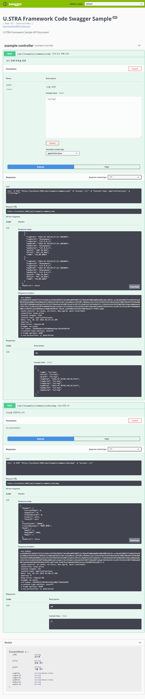

# U.STRA Framework - JAVA, Code Swagger 설정하기


# Objectives
> Swagger는 REST API를 설계, 빌드, 문서화 및 사용하는 데 도움이 될 수 있는 OpenAPI 사양을 기반으로 구축된 오픈 소스 도구 세트이며, 이 swagger를 프로젝트에 적용 방법을 설명한다.


# What You Need

- 약 15분 소요
- 선호하는 텍스트 편집기 혹은 IDE
- JDK 1.8 이상
- Gradle 6.x 버전 혹은 Maven 3.2 이상
    

# How to complete this guide

- 처음부터 시작하기
    - 프로젝트 시작하기 : [http://guide.ustraframework.kro.kr/download/installation](http://guide.ustraframework.kro.kr/download/installation)
- 다운로드하여 실행하기
    - Repository에서 Clone : [https://github.com/ustraframework/ustra-framework2.0-sample](https://github.com/ustraframework/ustra-framework2.0-sample)

# 예제 파일 다운로드

아래와 같이 github에서 샘플 전체를 다운로드 할 수 있으며, 다운로드 후 devextrme-board-crud 디렉토리로 이동한다.

```
git clone https://github.com/ustraframework/ustra-framework2.0-sample.git
```

- 코드 위치 : [https://github.com/ustraframework/ustra-framework2.0-sample/tree/master/java-swagger](https://github.com/ustraframework/ustra-framework2.0-sample/tree/master/java-swagger)


## Configuration

### 의존성 설정 (gradle)

- ~/build.gradle 파일에 아래 내용 추가

```groovy
dependencies {
    compile 'io.springfox:springfox-swagger2:2.9.2'
    compile 'io.springfox:springfox-swagger-ui:2.9.2'
}
```

### 어플리케이션 설정 클래스 작성
- Application 클래스가 있는 패키지에(예, com.gsitm.ustra.java.swagger.api) config 패키지를 추가하고(com.gsitm.ustra.java.swagger.api.config가 된다), SwaggerConfiguration.java 파일을 생성하여 아래 내용을 입력한다.

```java

 import org.springframework.context.annotation.Bean;
 import org.springframework.context.annotation.Configuration;
 import springfox.documentation.builders.ApiInfoBuilder;
 import springfox.documentation.builders.PathSelectors;
 import springfox.documentation.builders.RequestHandlerSelectors;
 import springfox.documentation.service.ApiInfo;
 import springfox.documentation.spi.DocumentationType;
 import springfox.documentation.spring.web.plugins.Docket;
 import springfox.documentation.swagger2.annotations.EnableSwagger2;

 @Configuration
 @EnableSwagger2
 public class SwaggerConfiguration {

     private ApiInfo swaggerInfo() {

         return new ApiInfoBuilder()
                 .title("U.STRA Framework Code Swagger Examples")
                 .description("U.STRA Framework Sample API Document")
                 .version("0.0.1")
                 .build();

     }

     @Bean
     public Docket swaggerApi() {
         return new Docket(DocumentationType.SWAGGER_2)
                 .useDefaultResponseMessages(false)
                 .select()
                 .apis(RequestHandlerSelectors.basePackage("com.gsitm.ustra.java.swagger.api"))
                 .paths(PathSelectors.ant("/api/**"))
                 //.paths(PathSelectors.ant("/**"))
                 .build()
                 .apiInfo(swaggerInfo());
     }
 }

```

- @Configuration: 설정 클래스 임을 나타내는 annotation
- @EnableSwagger2: Swagger2 버전 활성화 annotation
- ApiInfo swaggerInfo() : Swagger UI에 표시되는 설정 정보. title(), description(), version()
- Docket swaggerApi() : Swagger 설정의 핵심이되는 Bean, swagger 스프링 MVC 프레임워크를 사용해 스웨거 문서 생성을 구성하는 빌더 클래스
    - useDefaultResponseMessages()
        - false로 설정하면, Swagger에서 제공해주는 응답 코드(200, 401, 403, 404)에 대한 기본 메시지를 제거한다.
        - 불필요한 응답 코드와 메세지 제거하기 위함이며, 컨트롤러에 명시한다.
    - groupName()
        - Docket Bean이 한 개일 경우 기본 값은 default이므로, 생략 가능하다.
        - 여러 Docket Bean을 생성했을 경우 groupName이 충돌하지 않아야 하므로, 버전을 명시한다.
    - select() : ApiSelectorBuilder를 생성한다.
    - apis() :
        - **api 스펙이 작성되어 있는 패키지를 지정한다.**
        - **RequestMapping( GetMapping, PostMapping )이 선언된 API를 문서화 한다.**
    - paths() : apis()로 선택되어진 API 중 특정 path 조건에 맞는 API들을 다시 필터링하여 문서화한다.
    - apiInfo()
        - 제목, 설명 등 문서에 대한 정보들을 보여주기 위해 호출한다.
        - 파라미터 : title, description, version, termsOfServiceUrl, contact, license, licenseUrl, vendorExtensions

## Model 작성 및 주요 annotation

- 어플리케이션의 Model을 작성할 때 swagger 어노테이션을 이용한다.

```java

import com.gsitm.ustra.java.management.models.base.UstraManagementBaseModel;
import io.swagger.annotations.ApiModelProperty;
import lombok.AllArgsConstructor;
import lombok.Data;
import lombok.EqualsAndHashCode;
import lombok.NoArgsConstructor;
import lombok.experimental.SuperBuilder;

@SuperBuilder
@Data
@EqualsAndHashCode(callSuper = false)
@NoArgsConstructor
@AllArgsConstructor
public class ExampleModel extends UstraManagementBaseModel {

    @ApiModelProperty("그룹 코드")
    private String grpCd;

    @ApiModelProperty("상세 코드")
    private String dtlCd;

    @ApiModelProperty("코드명")
    private String cdNm;

    @Data
    public static class Criteria {
        @ApiModelProperty("사용여부")
        private String useYn;
    }
}


```

- @ApiModel: 스웨거 모델의 추가 정보를 제공
- @ApiModelProperty(name = "", example = ""): 모델 속성의 데이터를 추가하고 조작
    - name : 이름
    - example : 설명

## Controller 작성 및 주요 annotation

- 어플리케이션의 Controller를 작성할 때 swagger 어노테이션을 이용한다.

```java

import java.util.HashMap;
import java.util.List;
import java.util.Map;


import org.springframework.beans.factory.annotation.Autowired;
import org.springframework.web.bind.annotation.PostMapping;
import org.springframework.web.bind.annotation.RequestMapping;
import org.springframework.web.bind.annotation.RestController;

import io.swagger.annotations.Api;
import io.swagger.annotations.ApiOperation;
import io.swagger.annotations.ApiParam;

@Api("Configure Code Swagger with U.STRA Framework")
@RestController
@RequestMapping("/api/example")
public class ExampleController {

    @Autowired
    private ExampleService exampleService;

    @PostMapping("/common/code")
    @ApiOperation(value = "전체 코드 목록 조회", notes = "<strong>코드 전체 목록</string>을 반환")
    public List<ExampleModel> getAll(@ApiParam("사용 여부") String useYn) {

        ExampleModel.Criteria criteria = new ExampleModel.Criteria();
        criteria.setUseYn(useYn);

        return this.exampleService.getAll(criteria);
    }

    @PostMapping("/common/code/map")
    @ApiOperation(value = "Map 반환 API", notes = "Map을 반환하는 API")
    public Map<String, Object> getMap()
    {
        Map<String, Object> map = new HashMap<>();
        map.put("map1", 1);
        map.put("map2", 2);
        map.put("map1000", 1000);

        return map;
    }
}

```

- @Api(value = "", tags = "") : 해당 클래스가 Swagger 리소스라는 것을 명시한다.
    - value : 태그를 작성한다.
    - tags : tags를 사용하여 여러 개의 태그를 정의한다.
- @ApiOperation(value = "", notes ="") : 한 개의 operation(즉 API URL과 Method)을 선언한다.
    - value : API에 대한 간략한 설명(제목 같은 느낌으로)으로 작성한다.
    - notes : 자세한 설명을 작성한다.
- @ApiResponse(code = number, message = "" : operation의 가능한 response 명시
    - code : 응답 코드를 작성한다.
    - message : 응답에 대한 설명을 작성한다.
    - responseHeaders : 헤더를 추가한다.(Optional)
- @ApiResponses: 여러 ApiResponse 객체 리스트를 허용하는 래퍼
- @ApiParam(value = "", required = boolean, example = "") : 파라미터에 대한 정보 명시
    - value : 파라미터 정보를 작성한다.
    - required : 필수 파라미터이면 true, 아니면 false를 작성한다.
    - example : 테스트를 할 때, 보여줄 예시를 작성한다.
- @ApiImplicitParam(name = "", value = "", required = true/false, dataType = "", paramType = "", defaultValue = "") : Request Parameter 설명
- @ApiIgnore : @ApiImplictParam으로 선언하지않은 parameter 정보들을 swagger UI에서 제외.

## 접근 방법

- 웹 브라우저의 주소창에 [http://localhost:8981/swagger-ui.html](http://localhost:8981/swagger-ui.html) 입력하여 접속




## Summary
- 

## SEE ALSO

### 기타 annotation

- @Authorization: 리소스나 오퍼레이션에 사용되는 권한 부여 체계를 선언
- @AurhorizationScope: OAuth2 인증 범위를 설명
- @ResponseHeader: 응답의 일부로 제공될 수 있는 헤더를 나타낸다
- @SwaggerDefinition: 생성된 스웨거 정의에 추가할 정의 레벨 속성
- @Info: 스웨거 정의의 일반 메타 데이터
- @Contact: 스웨거 정의를 위해 연락할 사람을 설명하는 속성
- @License: 스웨거 정의의 라이센스를 설명하는 속성

### official swagger site

- main : [https://swagger.io](https://swagger.io/)
- swagger2 document : [https://swagger.io/docs/specification/2-0/basic-structure/](https://swagger.io/docs/specification/2-0/basic-structure/)


### Reference in U.STRA Framework Guide Site
- 이 가이드 문서를 이해하는 데 도움이 될 추가 자료는 아래의 링크에서 확인할 수 있다.

  - 주제별 참고 문서
    - [Framework 2.0 - JAVA > 기타 가이드 > Code Swagger](http://guide.ustraframework.kro.kr/ref-doc/02/22awZln0pB5QddTkZahr)


  - 연관 샘플

